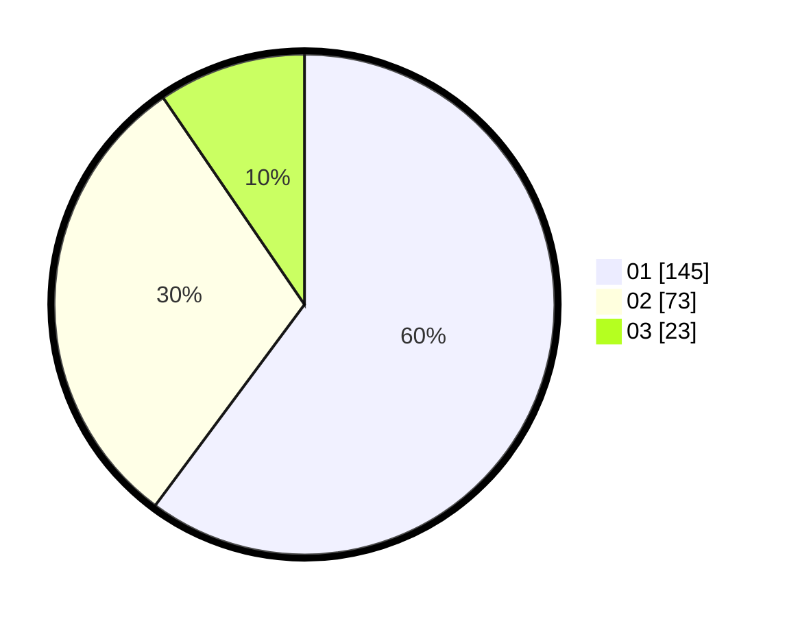

# Hasil

Hasil perolehan suara paslon dapat dilihat pada file paslon-01.txt, paslon-02.txt, dan paslon-03.txt.

Jika tidak ada, artinya data tersebut belum ada pada SIREKAP.

## Perolehan Suara

 * Paslon 01: **145**.
 * Paslon 02: **73**.
 * Paslon 03: **23**.

## Foto C Plano

https://sirekap-obj-formc.kpu.go.id/2df8/pemilu/ppwp/31/74/09/10/03/3174091003109-20240214-224724--564f12ea-3fe1-4f67-a14a-162b73f52822.jpg

https://sirekap-obj-formc.kpu.go.id/2df8/pemilu/ppwp/31/74/09/10/03/3174091003109-20240214-224831--cc36108e-964e-40c8-bf80-af180faa8083.jpg

https://sirekap-obj-formc.kpu.go.id/2df8/pemilu/ppwp/31/74/09/10/03/3174091003109-20240214-224941--a24d0fa2-6b7b-4575-bbb7-aa323dd07902.jpg

## DATA PEMILIH TETAP

Jumlah pemilih dalam DPT: **260**.
 * L: **130**.
 * P: **130**.

## DATA PENGGUNA HAK PILIH

Jumlah pengguna hak pilih dalam DPT: **234**.
 * L: **113**.
 * P: **121**.

Jumlah pengguna hak pilih dalam DPTb: **4**.
 * L: **2**.
 * P: **2**.

Jumlah pengguna hak pilih dalam DPK: **3**.
 * L: **2**.
 * P: **1**.

Jumlah pengguna hak pilih: **241**.
 * L: **117**.
 * P: **124**.

## JUMLAH SUARA SAH DAN TIDAK SAH

JUMLAH SELURUH SUARA SAH: **241**.

JUMLAH SUARA TIDAK SAH: **0**.

JUMLAH SELURUH SUARA SAH DAN SUARA TIDAK SAH: **241**.
