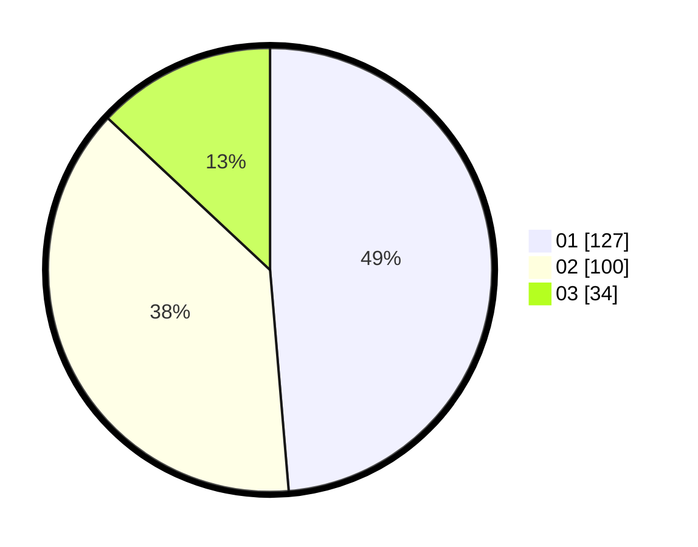

# Hasil

Hasil perolehan suara paslon dapat dilihat pada file paslon-01.txt, paslon-02.txt, dan paslon-03.txt.

Jika tidak ada, artinya data tersebut belum ada pada SIREKAP.

## Perolehan Suara

 * Paslon 01: **127**.
 * Paslon 02: **100**.
 * Paslon 03: **34**.

## Foto C Plano

https://sirekap-obj-formc.kpu.go.id/739a/pemilu/ppwp/31/74/09/10/03/3174091003114-20240214-155524--bd7a1e7c-206e-4d79-8b71-9f31f51ae725.jpg

https://sirekap-obj-formc.kpu.go.id/739a/pemilu/ppwp/31/74/09/10/03/3174091003114-20240214-155908--d3e83bf7-0047-45f7-9836-fa7eb49306a0.jpg

https://sirekap-obj-formc.kpu.go.id/739a/pemilu/ppwp/31/74/09/10/03/3174091003114-20240214-155617--31b81000-3666-4d1f-b216-2e3d5eec5e24.jpg

## DATA PEMILIH TETAP

Jumlah pemilih dalam DPT: **299**.
 * L: **152**.
 * P: **147**.

## DATA PENGGUNA HAK PILIH

Jumlah pengguna hak pilih dalam DPT: **262**.
 * L: **127**.
 * P: **135**.

Jumlah pengguna hak pilih dalam DPTb: **1**.
 * L: **0**.
 * P: **1**.

Jumlah pengguna hak pilih dalam DPK: **0**.
 * L: **0**.
 * P: **0**.

Jumlah pengguna hak pilih: **263**.
 * L: **127**.
 * P: **136**.

## JUMLAH SUARA SAH DAN TIDAK SAH

JUMLAH SELURUH SUARA SAH: **261**.

JUMLAH SUARA TIDAK SAH: **2**.

JUMLAH SELURUH SUARA SAH DAN SUARA TIDAK SAH: **263**.
