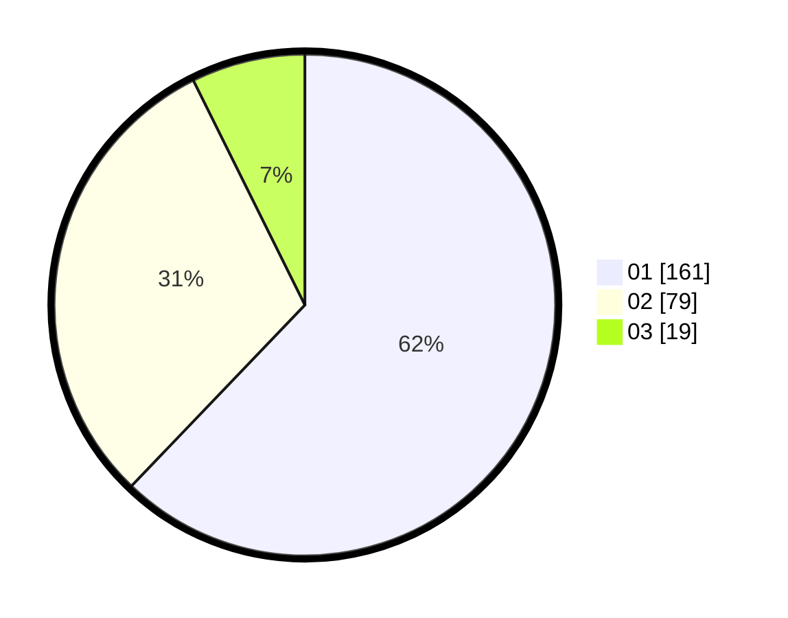

# Hasil

Hasil perolehan suara paslon dapat dilihat pada file paslon-01.txt, paslon-02.txt, dan paslon-03.txt.

Jika tidak ada, artinya data tersebut belum ada pada SIREKAP.

## Perolehan Suara

 * Paslon 01: **161**.
 * Paslon 02: **79**.
 * Paslon 03: **19**.

## Foto C Plano

https://sirekap-obj-formc.kpu.go.id/7a71/pemilu/ppwp/31/74/09/10/03/3174091003115-20240214-192640--3b0abf25-48e7-4b27-9bb1-b2cef7c7ec6e.jpg

https://sirekap-obj-formc.kpu.go.id/7a71/pemilu/ppwp/31/74/09/10/03/3174091003115-20240214-192735--1817e9cf-2dca-4dd0-8ad9-5f720018c845.jpg

https://sirekap-obj-formc.kpu.go.id/7a71/pemilu/ppwp/31/74/09/10/03/3174091003115-20240214-192915--ef66c849-2393-4227-b4b0-b61ba3403be5.jpg

## DATA PEMILIH TETAP

Jumlah pemilih dalam DPT: **293**.
 * L: **147**.
 * P: **146**.

## DATA PENGGUNA HAK PILIH

Jumlah pengguna hak pilih dalam DPT: **257**.
 * L: **120**.
 * P: **137**.

Jumlah pengguna hak pilih dalam DPTb: **5**.
 * L: **1**.
 * P: **4**.

Jumlah pengguna hak pilih dalam DPK: **0**.
 * L: **0**.
 * P: **0**.

Jumlah pengguna hak pilih: **262**.
 * L: **121**.
 * P: **145**.

## JUMLAH SUARA SAH DAN TIDAK SAH

JUMLAH SELURUH SUARA SAH: **259**.

JUMLAH SUARA TIDAK SAH: **3**.

JUMLAH SELURUH SUARA SAH DAN SUARA TIDAK SAH: **262**.
