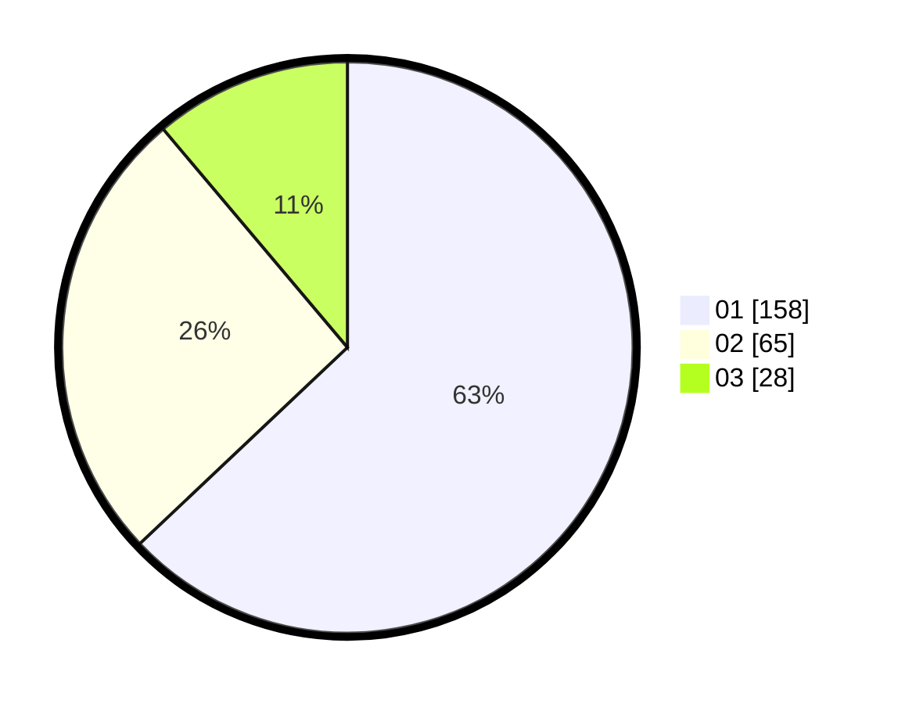

# Hasil

Hasil perolehan suara paslon dapat dilihat pada file paslon-01.txt, paslon-02.txt, dan paslon-03.txt.

Jika tidak ada, artinya data tersebut belum ada pada SIREKAP.

## Perolehan Suara

 * Paslon 01: **158**.
 * Paslon 02: **65**.
 * Paslon 03: **28**.

## Foto C Plano

https://sirekap-obj-formc.kpu.go.id/a7f5/pemilu/ppwp/31/74/09/10/03/3174091003116-20240215-003417--e995a173-032f-424f-9a8c-6f5410d011ff.jpg

https://sirekap-obj-formc.kpu.go.id/a7f5/pemilu/ppwp/31/74/09/10/03/3174091003116-20240214-201200--d7acdd22-43ac-429d-bb79-c9e71656e9dd.jpg

https://sirekap-obj-formc.kpu.go.id/a7f5/pemilu/ppwp/31/74/09/10/03/3174091003116-20240214-213307--44640fc5-88de-4061-8159-24e2f3d3f524.jpg
