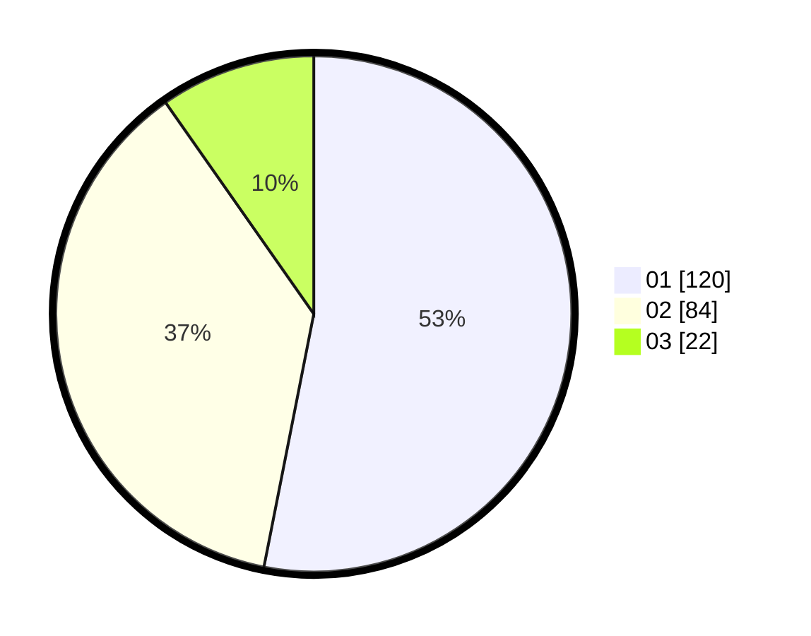

# Hasil

Hasil perolehan suara paslon dapat dilihat pada file paslon-01.txt, paslon-02.txt, dan paslon-03.txt.

Jika tidak ada, artinya data tersebut belum ada pada SIREKAP.

## Perolehan Suara

 * Paslon 01: **120**.
 * Paslon 02: **84**.
 * Paslon 03: **22**.

## Foto C Plano

https://sirekap-obj-formc.kpu.go.id/26e7/pemilu/ppwp/31/74/09/10/03/3174091003132-20240215-003914--6d3d7484-def7-4ed5-b8d0-fce2c1abb746.jpg

https://sirekap-obj-formc.kpu.go.id/26e7/pemilu/ppwp/31/74/09/10/03/3174091003132-20240215-004116--5d720825-2117-4108-ac18-f5faa45e4305.jpg

https://sirekap-obj-formc.kpu.go.id/26e7/pemilu/ppwp/31/74/09/10/03/3174091003132-20240215-004203--fe369869-4d72-4d1a-a081-5820879f5e43.jpg

## DATA PEMILIH TETAP

Jumlah pemilih dalam DPT: **282**.
 * L: **132**.
 * P: **150**.

## DATA PENGGUNA HAK PILIH

Jumlah pengguna hak pilih dalam DPT: **229**.
 * L: **105**.
 * P: **124**.

Jumlah pengguna hak pilih dalam DPTb: **0**.
 * L: **0**.
 * P: **0**.

Jumlah pengguna hak pilih dalam DPK: **1**.
 * L: **0**.
 * P: **1**.

Jumlah pengguna hak pilih: **230**.
 * L: **105**.
 * P: **125**.

## JUMLAH SUARA SAH DAN TIDAK SAH

JUMLAH SELURUH SUARA SAH: **226**.

JUMLAH SUARA TIDAK SAH: **4**.

JUMLAH SELURUH SUARA SAH DAN SUARA TIDAK SAH: **230**.
