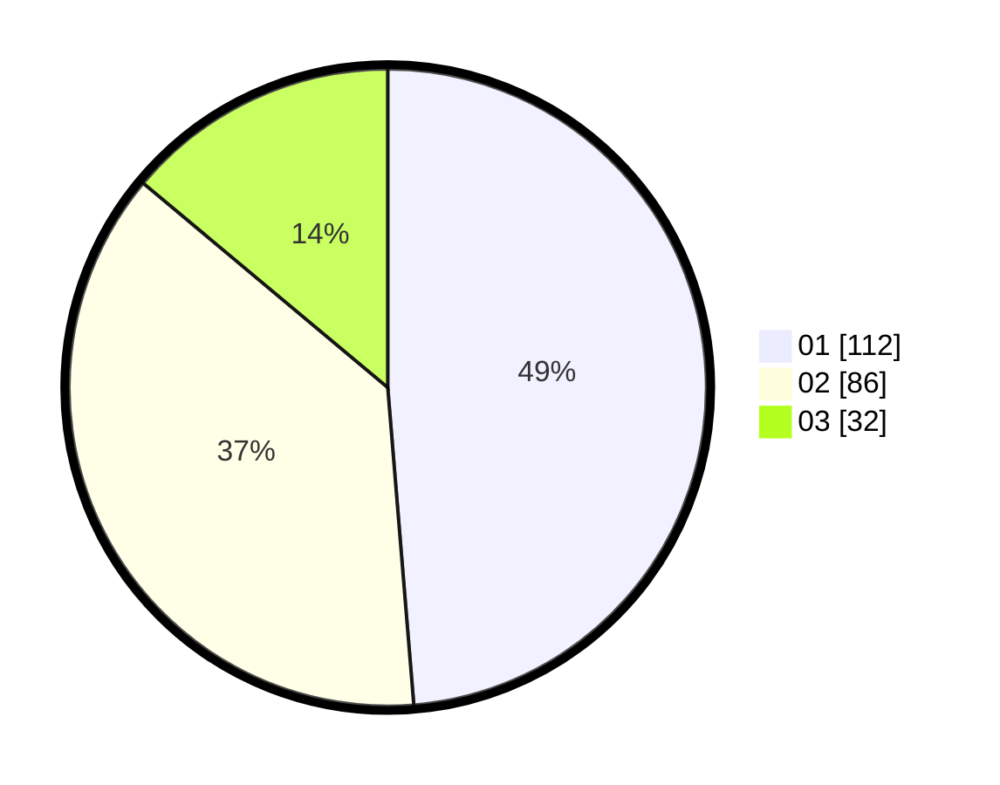

# Hasil

Hasil perolehan suara paslon dapat dilihat pada file paslon-01.txt, paslon-02.txt, dan paslon-03.txt.

Jika tidak ada, artinya data tersebut belum ada pada SIREKAP.

## Perolehan Suara

 * Paslon 01: **112**.
 * Paslon 02: **86**.
 * Paslon 03: **32**.

## Foto C Plano

https://sirekap-obj-formc.kpu.go.id/a295/pemilu/ppwp/31/74/09/10/04/3174091004001-20240214-194812--1f9a1ecf-4ff0-4c1d-8618-46db19bd7dbc.jpg

https://sirekap-obj-formc.kpu.go.id/a295/pemilu/ppwp/31/74/09/10/04/3174091004001-20240214-225103--686b4151-eba5-4d12-bcd3-cc755cc6d296.jpg

https://sirekap-obj-formc.kpu.go.id/a295/pemilu/ppwp/31/74/09/10/04/3174091004001-20240214-194825--2ed0925d-5a24-4816-971f-7a35a04db4f8.jpg

## DATA PEMILIH TETAP

Jumlah pemilih dalam DPT: **286**.
 * L: **150**.
 * P: **136**.

## DATA PENGGUNA HAK PILIH

Jumlah pengguna hak pilih dalam DPT: **226**.
 * L: **116**.
 * P: **110**.

Jumlah pengguna hak pilih dalam DPTb: **4**.
 * L: **1**.
 * P: **3**.

Jumlah pengguna hak pilih dalam DPK: **2**.
 * L: **1**.
 * P: **1**.

Jumlah pengguna hak pilih: **232**.
 * L: **118**.
 * P: **114**.

## JUMLAH SUARA SAH DAN TIDAK SAH

JUMLAH SELURUH SUARA SAH: **230**.

JUMLAH SUARA TIDAK SAH: **2**.

JUMLAH SELURUH SUARA SAH DAN SUARA TIDAK SAH: **232**.
