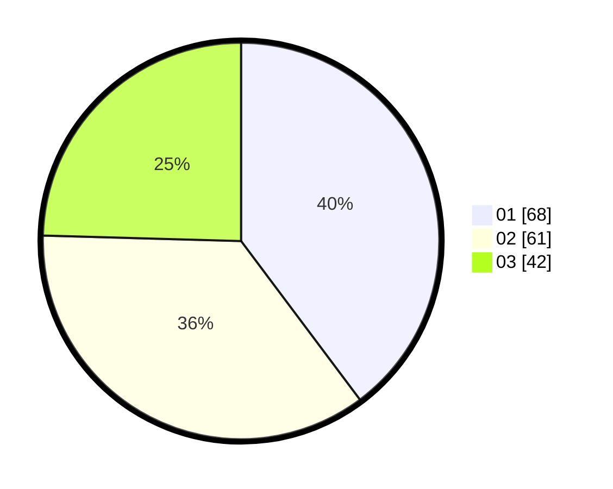

# Hasil

Hasil perolehan suara paslon dapat dilihat pada file paslon-01.txt, paslon-02.txt, dan paslon-03.txt.

Jika tidak ada, artinya data tersebut belum ada pada SIREKAP.

## Perolehan Suara

 * Paslon 01: **68**.
 * Paslon 02: **61**.
 * Paslon 03: **42**.

## Foto C Plano

https://sirekap-obj-formc.kpu.go.id/ae34/pemilu/ppwp/31/74/09/10/04/3174091004006-20240214-141607--8f829531-b844-42c1-b9aa-3abc34a401a5.jpg

https://sirekap-obj-formc.kpu.go.id/ae34/pemilu/ppwp/31/74/09/10/04/3174091004006-20240214-141111--32cde73f-74f4-4e1c-a497-e218135d7f8d.jpg

https://sirekap-obj-formc.kpu.go.id/ae34/pemilu/ppwp/31/74/09/10/04/3174091004006-20240214-141846--d5d62783-bd81-4772-89cd-ad29bf19e505.jpg

## DATA PEMILIH TETAP

Jumlah pemilih dalam DPT: **226**.
 * L: **113**.
 * P: **113**.

## DATA PENGGUNA HAK PILIH

Jumlah pengguna hak pilih dalam DPT: **167**.
 * L: **83**.
 * P: **84**.

Jumlah pengguna hak pilih dalam DPTb: **4**.
 * L: **1**.
 * P: **3**.

Jumlah pengguna hak pilih dalam DPK: **2**.
 * L: **0**.
 * P: **2**.

Jumlah pengguna hak pilih: **173**.
 * L: **84**.
 * P: **89**.

## JUMLAH SUARA SAH DAN TIDAK SAH

JUMLAH SELURUH SUARA SAH: **171**.

JUMLAH SUARA TIDAK SAH: **2**.

JUMLAH SELURUH SUARA SAH DAN SUARA TIDAK SAH: **173**.
