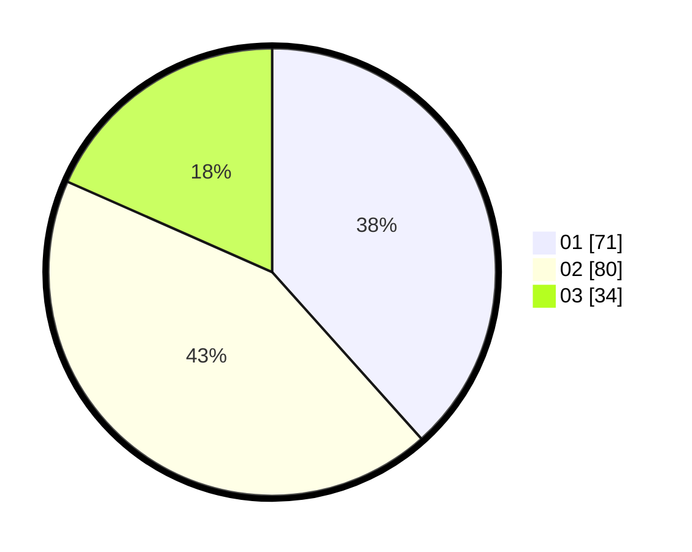

# Hasil

Hasil perolehan suara paslon dapat dilihat pada file paslon-01.txt, paslon-02.txt, dan paslon-03.txt.

Jika tidak ada, artinya data tersebut belum ada pada SIREKAP.

## Perolehan Suara

 * Paslon 01: **71**.
 * Paslon 02: **80**.
 * Paslon 03: **34**.

## Foto C Plano

https://sirekap-obj-formc.kpu.go.id/53d5/pemilu/ppwp/31/74/09/10/04/3174091004012-20240214-192918--2108320c-2740-41de-be74-8abe3fd882b8.jpg

https://sirekap-obj-formc.kpu.go.id/53d5/pemilu/ppwp/31/74/09/10/04/3174091004012-20240214-192946--46bc02d1-36ee-4292-88e1-e2cb87ba8912.jpg

https://sirekap-obj-formc.kpu.go.id/53d5/pemilu/ppwp/31/74/09/10/04/3174091004012-20240214-193008--61f680d9-66ed-4936-a574-953b3cf5bbfd.jpg

## DATA PEMILIH TETAP

Jumlah pemilih dalam DPT: **231**.
 * L: **118**.
 * P: **113**.

## DATA PENGGUNA HAK PILIH

Jumlah pengguna hak pilih dalam DPT: **182**.
 * L: **94**.
 * P: **88**.

Jumlah pengguna hak pilih dalam DPTb: **5**.
 * L: **2**.
 * P: **3**.

Jumlah pengguna hak pilih dalam DPK: **5**.
 * L: **3**.
 * P: **2**.

Jumlah pengguna hak pilih: **192**.
 * L: **99**.
 * P: **93**.

## JUMLAH SUARA SAH DAN TIDAK SAH

JUMLAH SELURUH SUARA SAH: **185**.

JUMLAH SUARA TIDAK SAH: **7**.

JUMLAH SELURUH SUARA SAH DAN SUARA TIDAK SAH: **192**.
