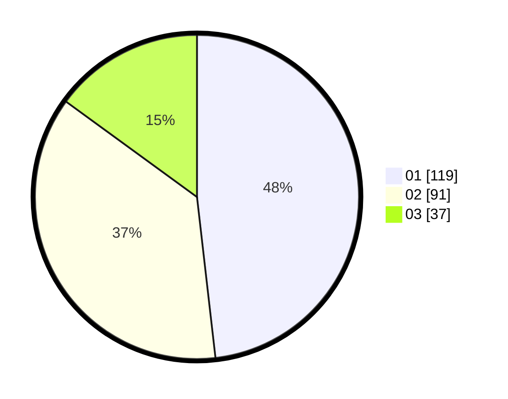

# Hasil

Hasil perolehan suara paslon dapat dilihat pada file paslon-01.txt, paslon-02.txt, dan paslon-03.txt.

Jika tidak ada, artinya data tersebut belum ada pada SIREKAP.

## Perolehan Suara

 * Paslon 01: **119**.
 * Paslon 02: **91**.
 * Paslon 03: **37**.

## Foto C Plano

https://sirekap-obj-formc.kpu.go.id/cf0c/pemilu/ppwp/31/74/09/10/04/3174091004022-20240214-192214--17abd4c2-f9bd-49f4-881f-85e5b05ef0fa.jpg

https://sirekap-obj-formc.kpu.go.id/cf0c/pemilu/ppwp/31/74/09/10/04/3174091004022-20240214-195008--8cb8dff7-7cff-43e2-bafb-170bffeb3939.jpg

https://sirekap-obj-formc.kpu.go.id/cf0c/pemilu/ppwp/31/74/09/10/04/3174091004022-20240216-110409--994aecd0-ec7f-481e-b214-a960f10384d2.jpg

## DATA PEMILIH TETAP

Jumlah pemilih dalam DPT: **297**.
 * L: **141**.
 * P: **156**.

## DATA PENGGUNA HAK PILIH

Jumlah pengguna hak pilih dalam DPT: **248**.
 * L: **115**.
 * P: **133**.

Jumlah pengguna hak pilih dalam DPTb: **0**.
 * L: **0**.
 * P: **0**.

Jumlah pengguna hak pilih dalam DPK: **2**.
 * L: **0**.
 * P: **2**.

Jumlah pengguna hak pilih: **250**.
 * L: **115**.
 * P: **135**.

## JUMLAH SUARA SAH DAN TIDAK SAH

JUMLAH SELURUH SUARA SAH: **247**.

JUMLAH SUARA TIDAK SAH: **3**.

JUMLAH SELURUH SUARA SAH DAN SUARA TIDAK SAH: **250**.
