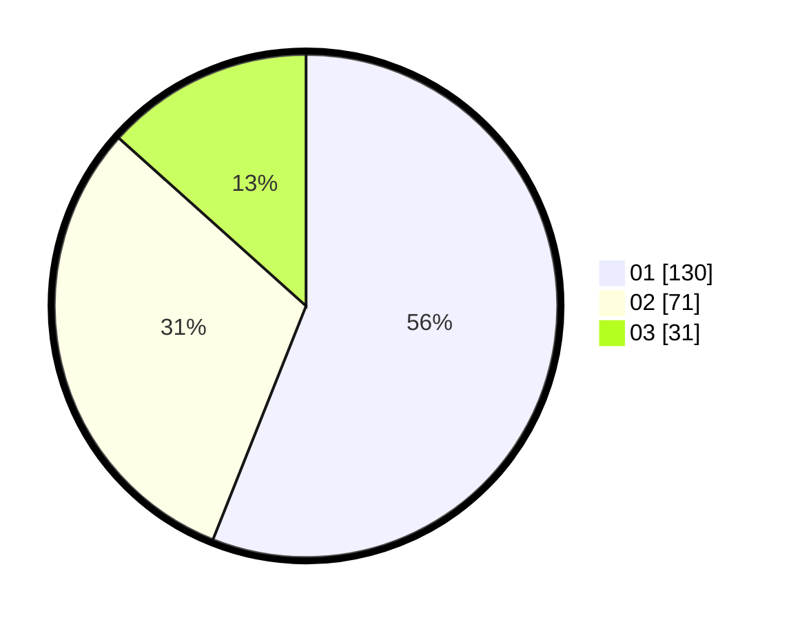

# Hasil

Hasil perolehan suara paslon dapat dilihat pada file paslon-01.txt, paslon-02.txt, dan paslon-03.txt.

Jika tidak ada, artinya data tersebut belum ada pada SIREKAP.

## Perolehan Suara

 * Paslon 01: **130**.
 * Paslon 02: **71**.
 * Paslon 03: **31**.

## Foto C Plano

https://sirekap-obj-formc.kpu.go.id/2a4a/pemilu/ppwp/31/74/09/10/04/3174091004023-20240215-002325--64ad66b3-e097-4e56-b182-d499a89fd6a0.jpg

https://sirekap-obj-formc.kpu.go.id/2a4a/pemilu/ppwp/31/74/09/10/04/3174091004023-20240218-212423--fc95d860-7320-4c96-b0da-d4ae540f288d.jpg

https://sirekap-obj-formc.kpu.go.id/2a4a/pemilu/ppwp/31/74/09/10/04/3174091004023-20240218-212422--4578f5df-9efb-44fa-9a3b-a90ab4eaf50c.jpg

## DATA PEMILIH TETAP

Jumlah pemilih dalam DPT: **290**.
 * L: **143**.
 * P: **147**.

## DATA PENGGUNA HAK PILIH

Jumlah pengguna hak pilih dalam DPT: **233**.
 * L: **103**.
 * P: **130**.

Jumlah pengguna hak pilih dalam DPTb: **1**.
 * L: **0**.
 * P: **1**.

Jumlah pengguna hak pilih dalam DPK: **1**.
 * L: **0**.
 * P: **1**.

Jumlah pengguna hak pilih: **235**.
 * L: **103**.
 * P: **132**.

## JUMLAH SUARA SAH DAN TIDAK SAH

JUMLAH SELURUH SUARA SAH: **232**.

JUMLAH SUARA TIDAK SAH: **3**.

JUMLAH SELURUH SUARA SAH DAN SUARA TIDAK SAH: **235**.
