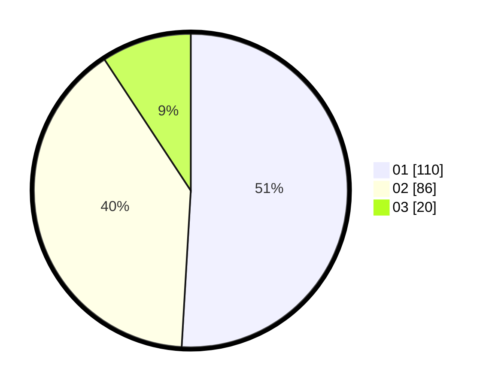

# Hasil

Hasil perolehan suara paslon dapat dilihat pada file paslon-01.txt, paslon-02.txt, dan paslon-03.txt.

Jika tidak ada, artinya data tersebut belum ada pada SIREKAP.

## Perolehan Suara

 * Paslon 01: **110**.
 * Paslon 02: **86**.
 * Paslon 03: **20**.

## Foto C Plano

https://sirekap-obj-formc.kpu.go.id/fb5a/pemilu/ppwp/31/74/09/10/04/3174091004024-20240216-142920--86ba58d5-7157-4c9b-afd2-c65d01ebcb6a.jpg

https://sirekap-obj-formc.kpu.go.id/fb5a/pemilu/ppwp/31/74/09/10/04/3174091004024-20240216-142251--fb53d35c-a219-42f0-a7e0-ef09fdae1cdc.jpg

https://sirekap-obj-formc.kpu.go.id/fb5a/pemilu/ppwp/31/74/09/10/04/3174091004024-20240216-150758--fab6cbee-94e5-4b85-93e6-de85a833c7aa.jpg

## DATA PEMILIH TETAP

Jumlah pemilih dalam DPT: **275**.
 * L: **124**.
 * P: **151**.

## DATA PENGGUNA HAK PILIH

Jumlah pengguna hak pilih dalam DPT: **215**.
 * L: **90**.
 * P: **125**.

Jumlah pengguna hak pilih dalam DPTb: **4**.
 * L: **3**.
 * P: **1**.

Jumlah pengguna hak pilih dalam DPK: **1**.
 * L: **1**.
 * P: **0**.

Jumlah pengguna hak pilih: **220**.
 * L: **94**.
 * P: **126**.

## JUMLAH SUARA SAH DAN TIDAK SAH

JUMLAH SELURUH SUARA SAH: **216**.

JUMLAH SUARA TIDAK SAH: **4**.

JUMLAH SELURUH SUARA SAH DAN SUARA TIDAK SAH: **220**.
