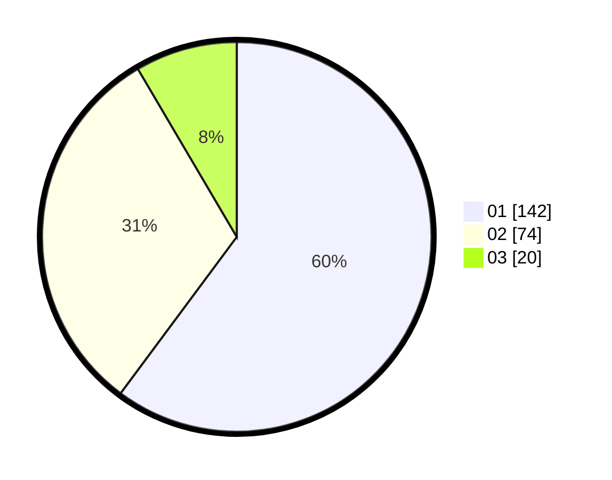

# Hasil

Hasil perolehan suara paslon dapat dilihat pada file paslon-01.txt, paslon-02.txt, dan paslon-03.txt.

Jika tidak ada, artinya data tersebut belum ada pada SIREKAP.

## Perolehan Suara

 * Paslon 01: **142**.
 * Paslon 02: **74**.
 * Paslon 03: **20**.

## Foto C Plano

https://sirekap-obj-formc.kpu.go.id/2b32/pemilu/ppwp/31/74/09/10/04/3174091004026-20240214-204227--08d93333-2e8f-4656-960c-47c1ef388c5f.jpg

https://sirekap-obj-formc.kpu.go.id/2b32/pemilu/ppwp/31/74/09/10/04/3174091004026-20240214-194732--2d9eec20-24ca-4516-bd05-b972865e658d.jpg

https://sirekap-obj-formc.kpu.go.id/2b32/pemilu/ppwp/31/74/09/10/04/3174091004026-20240214-185427--ea8e5731-b283-4582-9012-aa23750e17fb.jpg
