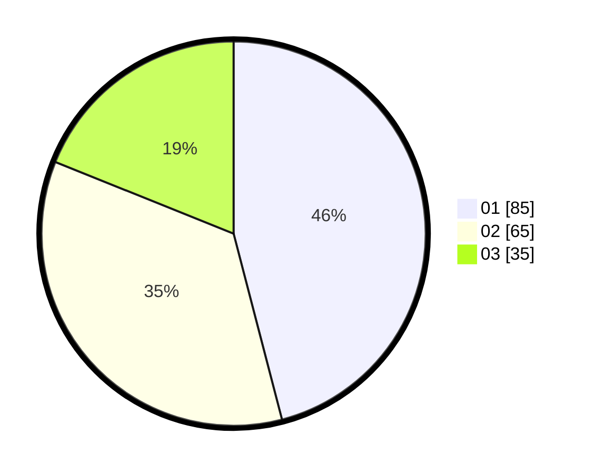

# Hasil

Hasil perolehan suara paslon dapat dilihat pada file paslon-01.txt, paslon-02.txt, dan paslon-03.txt.

Jika tidak ada, artinya data tersebut belum ada pada SIREKAP.

## Perolehan Suara

 * Paslon 01: **85**.
 * Paslon 02: **65**.
 * Paslon 03: **35**.

## Foto C Plano

https://sirekap-obj-formc.kpu.go.id/b7ed/pemilu/ppwp/31/74/09/10/04/3174091004028-20240215-213920--beaae324-12c2-45eb-b1d2-daa31e1d3d43.jpg

https://sirekap-obj-formc.kpu.go.id/b7ed/pemilu/ppwp/31/74/09/10/04/3174091004028-20240215-213927--c4d2f094-3193-48a3-8f57-b3f200d0cc6e.jpg

https://sirekap-obj-formc.kpu.go.id/b7ed/pemilu/ppwp/31/74/09/10/04/3174091004028-20240215-213923--f41db2fa-09b6-4e45-b5aa-3d5f15a1b0d2.jpg

## DATA PEMILIH TETAP

Jumlah pemilih dalam DPT: **217**.
 * L: **114**.
 * P: **103**.

## DATA PENGGUNA HAK PILIH

Jumlah pengguna hak pilih dalam DPT: **189**.
 * L: **98**.
 * P: **91**.

Jumlah pengguna hak pilih dalam DPTb: **0**.
 * L: **0**.
 * P: **0**.

Jumlah pengguna hak pilih dalam DPK: **0**.
 * L: **0**.
 * P: **0**.

Jumlah pengguna hak pilih: **189**.
 * L: **98**.
 * P: **91**.

## JUMLAH SUARA SAH DAN TIDAK SAH

JUMLAH SELURUH SUARA SAH: **185**.

JUMLAH SUARA TIDAK SAH: **4**.

JUMLAH SELURUH SUARA SAH DAN SUARA TIDAK SAH: **189**.
