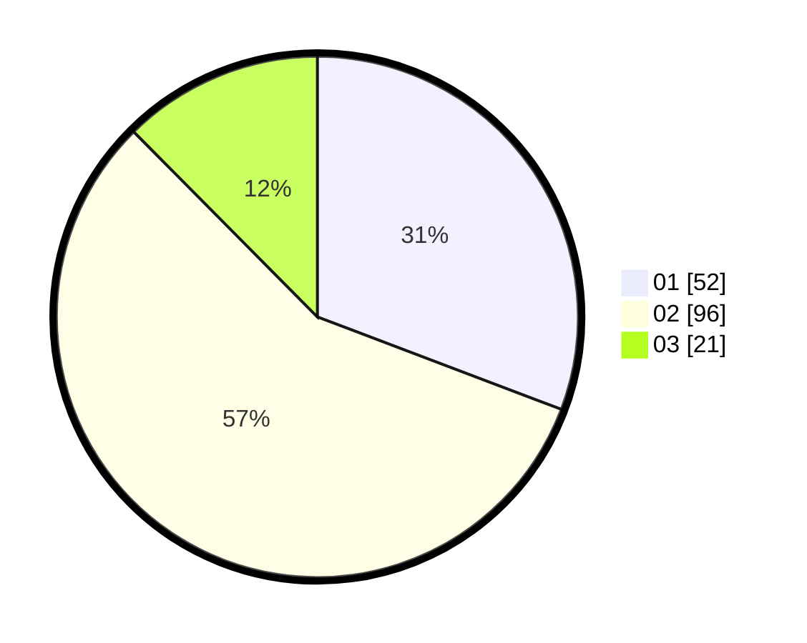

# Hasil

Hasil perolehan suara paslon dapat dilihat pada file paslon-01.txt, paslon-02.txt, dan paslon-03.txt.

Jika tidak ada, artinya data tersebut belum ada pada SIREKAP.

## Perolehan Suara

 * Paslon 01: **52**.
 * Paslon 02: **96**.
 * Paslon 03: **21**.

## Foto C Plano

https://sirekap-obj-formc.kpu.go.id/02d2/pemilu/ppwp/31/74/09/10/04/3174091004029-20240216-015401--40401168-d293-4693-a179-0a39a9066d85.jpg

https://sirekap-obj-formc.kpu.go.id/02d2/pemilu/ppwp/31/74/09/10/04/3174091004029-20240216-015406--14abcf5f-c750-486f-9358-1c1b908580ac.jpg

https://sirekap-obj-formc.kpu.go.id/02d2/pemilu/ppwp/31/74/09/10/04/3174091004029-20240214-205058--ebfdbdbc-2a00-433b-b0e8-a39ce73f7aec.jpg

## DATA PEMILIH TETAP

Jumlah pemilih dalam DPT: **173**.
 * L: **78**.
 * P: **95**.

## DATA PENGGUNA HAK PILIH

Jumlah pengguna hak pilih dalam DPT: **171**.
 * L: **77**.
 * P: **94**.

Jumlah pengguna hak pilih dalam DPTb: **1**.
 * L: **1**.
 * P: **0**.

Jumlah pengguna hak pilih dalam DPK: **1**.
 * L: **0**.
 * P: **1**.

Jumlah pengguna hak pilih: **173**.
 * L: **78**.
 * P: **95**.

## JUMLAH SUARA SAH DAN TIDAK SAH

JUMLAH SELURUH SUARA SAH: **169**.

JUMLAH SUARA TIDAK SAH: **4**.

JUMLAH SELURUH SUARA SAH DAN SUARA TIDAK SAH: **173**.
