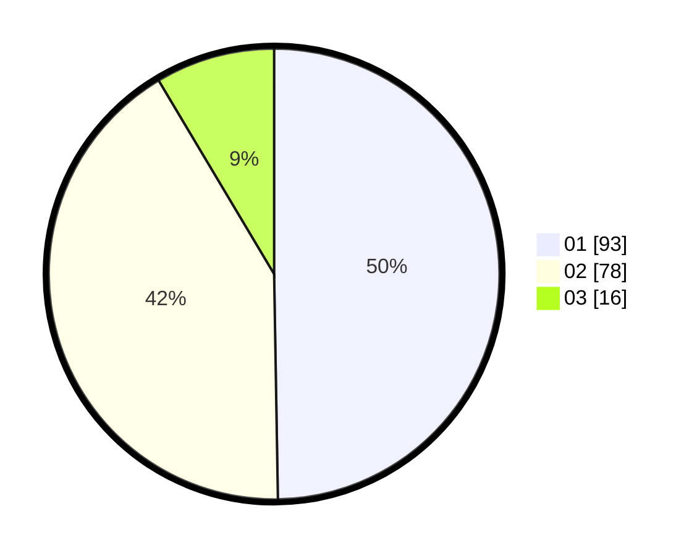

# Hasil

Hasil perolehan suara paslon dapat dilihat pada file paslon-01.txt, paslon-02.txt, dan paslon-03.txt.

Jika tidak ada, artinya data tersebut belum ada pada SIREKAP.

## Perolehan Suara

 * Paslon 01: **93**.
 * Paslon 02: **78**.
 * Paslon 03: **16**.

## Foto C Plano

https://sirekap-obj-formc.kpu.go.id/fbe0/pemilu/ppwp/31/74/09/10/04/3174091004030-20240214-210229--7d8087f5-3ad2-443e-88dc-491b6dc4f17d.jpg

https://sirekap-obj-formc.kpu.go.id/fbe0/pemilu/ppwp/31/74/09/10/04/3174091004030-20240214-210322--5a7fdf0c-a197-4a0e-9074-63f7277f7375.jpg

https://sirekap-obj-formc.kpu.go.id/fbe0/pemilu/ppwp/31/74/09/10/04/3174091004030-20240214-210402--4d48b1b2-b196-4c6a-99aa-1cdc9ae32e10.jpg

## DATA PEMILIH TETAP

Jumlah pemilih dalam DPT: **227**.
 * L: **114**.
 * P: **113**.

## DATA PENGGUNA HAK PILIH

Jumlah pengguna hak pilih dalam DPT: **189**.
 * L: **94**.
 * P: **95**.

Jumlah pengguna hak pilih dalam DPTb: **0**.
 * L: **0**.
 * P: **0**.

Jumlah pengguna hak pilih dalam DPK: **2**.
 * L: **0**.
 * P: **2**.

Jumlah pengguna hak pilih: **191**.
 * L: **94**.
 * P: **97**.

## JUMLAH SUARA SAH DAN TIDAK SAH

JUMLAH SELURUH SUARA SAH: **187**.

JUMLAH SUARA TIDAK SAH: **4**.

JUMLAH SELURUH SUARA SAH DAN SUARA TIDAK SAH: **191**.
