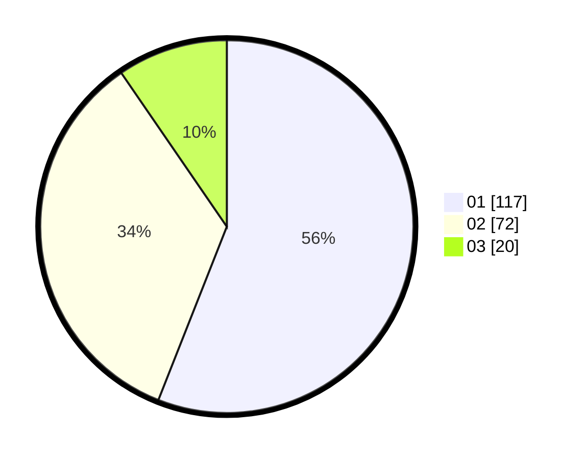

# Hasil

Hasil perolehan suara paslon dapat dilihat pada file paslon-01.txt, paslon-02.txt, dan paslon-03.txt.

Jika tidak ada, artinya data tersebut belum ada pada SIREKAP.

## Perolehan Suara

 * Paslon 01: **117**.
 * Paslon 02: **72**.
 * Paslon 03: **20**.

## Foto C Plano

https://sirekap-obj-formc.kpu.go.id/0089/pemilu/ppwp/31/74/09/10/04/3174091004036-20240214-192205--495ad4c2-8cb1-4208-8465-3b341747752f.jpg

https://sirekap-obj-formc.kpu.go.id/0089/pemilu/ppwp/31/74/09/10/04/3174091004036-20240214-192910--2c4a1de2-2107-4a2d-9dfd-84eafa4131a3.jpg

https://sirekap-obj-formc.kpu.go.id/0089/pemilu/ppwp/31/74/09/10/04/3174091004036-20240214-193239--ed16f716-f0f4-4268-b8b5-ec891e6d2987.jpg

## DATA PEMILIH TETAP

Jumlah pemilih dalam DPT: **275**.
 * L: **126**.
 * P: **149**.

## DATA PENGGUNA HAK PILIH

Jumlah pengguna hak pilih dalam DPT: **209**.
 * L: **88**.
 * P: **121**.

Jumlah pengguna hak pilih dalam DPTb: **0**.
 * L: **0**.
 * P: **0**.

Jumlah pengguna hak pilih dalam DPK: **1**.
 * L: **1**.
 * P: **0**.

Jumlah pengguna hak pilih: **210**.
 * L: **89**.
 * P: **121**.

## JUMLAH SUARA SAH DAN TIDAK SAH

JUMLAH SELURUH SUARA SAH: **209**.

JUMLAH SUARA TIDAK SAH: **1**.

JUMLAH SELURUH SUARA SAH DAN SUARA TIDAK SAH: **210**.
