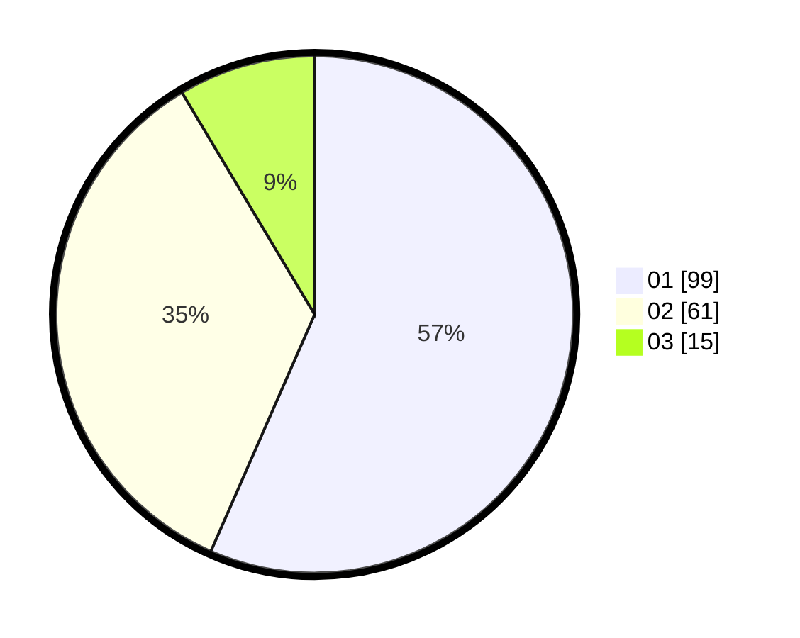

# Hasil

Hasil perolehan suara paslon dapat dilihat pada file paslon-01.txt, paslon-02.txt, dan paslon-03.txt.

Jika tidak ada, artinya data tersebut belum ada pada SIREKAP.

## Perolehan Suara

 * Paslon 01: **99**.
 * Paslon 02: **61**.
 * Paslon 03: **15**.

## Foto C Plano

https://sirekap-obj-formc.kpu.go.id/c17b/pemilu/ppwp/31/74/09/10/04/3174091004038-20240214-190807--1de74b0a-b101-4ea3-addf-e3fc5cbf22ab.jpg

https://sirekap-obj-formc.kpu.go.id/c17b/pemilu/ppwp/31/74/09/10/04/3174091004038-20240214-190825--42436976-b1ee-4390-940c-e920ae5b8ed1.jpg

https://sirekap-obj-formc.kpu.go.id/c17b/pemilu/ppwp/31/74/09/10/04/3174091004038-20240214-190840--7e558a3e-ffb7-4952-820b-b19e7c8b1b4c.jpg

## DATA PEMILIH TETAP

Jumlah pemilih dalam DPT: **217**.
 * L: **110**.
 * P: **107**.

## DATA PENGGUNA HAK PILIH

Jumlah pengguna hak pilih dalam DPT: **174**.
 * L: **83**.
 * P: **91**.

Jumlah pengguna hak pilih dalam DPTb: **0**.
 * L: **0**.
 * P: **0**.

Jumlah pengguna hak pilih dalam DPK: **3**.
 * L: **2**.
 * P: **1**.

Jumlah pengguna hak pilih: **177**.
 * L: **85**.
 * P: **92**.

## JUMLAH SUARA SAH DAN TIDAK SAH

JUMLAH SELURUH SUARA SAH: **175**.

JUMLAH SUARA TIDAK SAH: **2**.

JUMLAH SELURUH SUARA SAH DAN SUARA TIDAK SAH: **177**.
