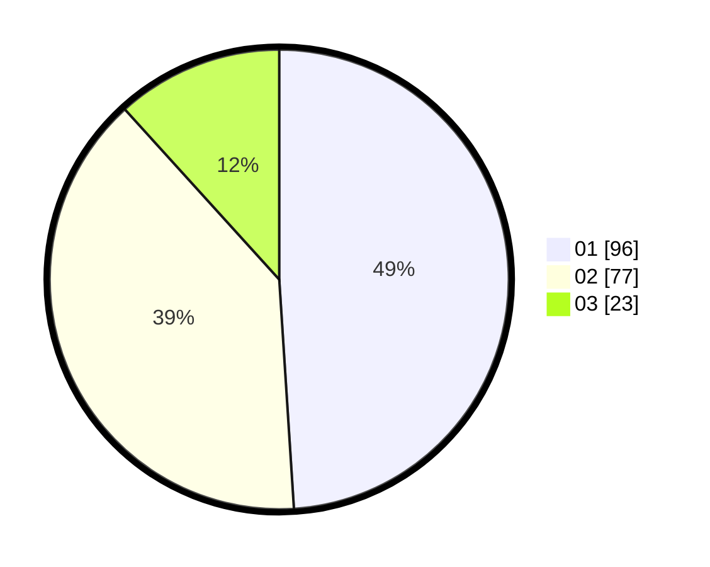

# Hasil

Hasil perolehan suara paslon dapat dilihat pada file paslon-01.txt, paslon-02.txt, dan paslon-03.txt.

Jika tidak ada, artinya data tersebut belum ada pada SIREKAP.

## Perolehan Suara

 * Paslon 01: **96**.
 * Paslon 02: **77**.
 * Paslon 03: **23**.

## Foto C Plano

https://sirekap-obj-formc.kpu.go.id/700e/pemilu/ppwp/31/74/09/10/04/3174091004041-20240214-223341--1bf59397-3ac4-404c-9023-5aa9580524d4.jpg

https://sirekap-obj-formc.kpu.go.id/700e/pemilu/ppwp/31/74/09/10/04/3174091004041-20240214-223624--c82c1834-1ff5-49dd-9719-db2eb3087c5c.jpg

https://sirekap-obj-formc.kpu.go.id/700e/pemilu/ppwp/31/74/09/10/04/3174091004041-20240214-223916--f81b4196-2410-4256-a8b1-4ee026b8a004.jpg
