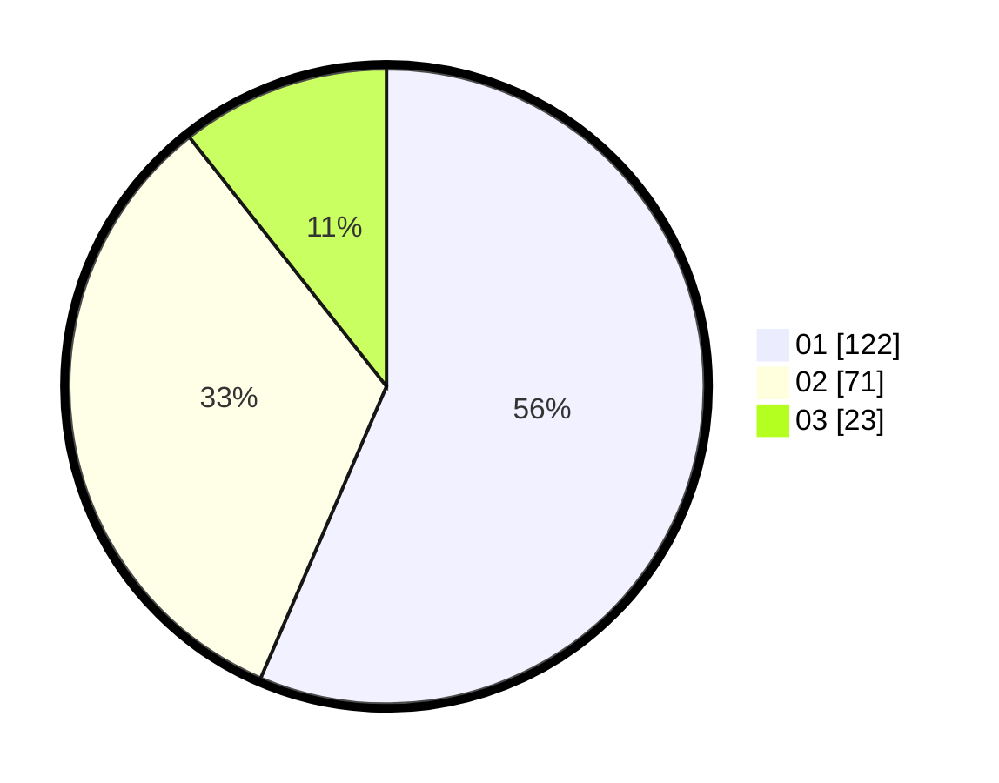

# Hasil

Hasil perolehan suara paslon dapat dilihat pada file paslon-01.txt, paslon-02.txt, dan paslon-03.txt.

Jika tidak ada, artinya data tersebut belum ada pada SIREKAP.

## Perolehan Suara

 * Paslon 01: **122**.
 * Paslon 02: **71**.
 * Paslon 03: **23**.

## Foto C Plano

https://sirekap-obj-formc.kpu.go.id/cc4e/pemilu/ppwp/31/74/09/10/04/3174091004047-20240214-155308--f4e90c5e-f0d6-4506-8cf0-5db9553cf05b.jpg

https://sirekap-obj-formc.kpu.go.id/cc4e/pemilu/ppwp/31/74/09/10/04/3174091004047-20240216-210817--0db10a09-825a-432f-b7a2-1870923b311d.jpg

https://sirekap-obj-formc.kpu.go.id/cc4e/pemilu/ppwp/31/74/09/10/04/3174091004047-20240214-175314--3b4b8130-e79b-46e7-aca2-fd9df4fbbc6b.jpg

## DATA PEMILIH TETAP

Jumlah pemilih dalam DPT: **219**.
 * L: **109**.
 * P: **110**.

## DATA PENGGUNA HAK PILIH

Jumlah pengguna hak pilih dalam DPT: **219**.
 * L: **109**.
 * P: **110**.

Jumlah pengguna hak pilih dalam DPTb: **2**.
 * L: **1**.
 * P: **1**.

Jumlah pengguna hak pilih dalam DPK: **2**.
 * L: **1**.
 * P: **1**.

Jumlah pengguna hak pilih: **223**.
 * L: **111**.
 * P: **112**.

## JUMLAH SUARA SAH DAN TIDAK SAH

JUMLAH SELURUH SUARA SAH: **216**.

JUMLAH SUARA TIDAK SAH: **7**.

JUMLAH SELURUH SUARA SAH DAN SUARA TIDAK SAH: **223**.
