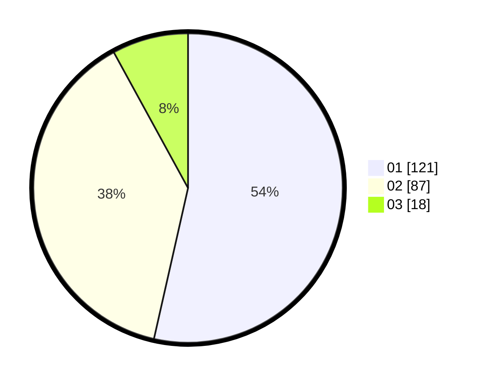

# Hasil

Hasil perolehan suara paslon dapat dilihat pada file paslon-01.txt, paslon-02.txt, dan paslon-03.txt.

Jika tidak ada, artinya data tersebut belum ada pada SIREKAP.

## Perolehan Suara

 * Paslon 01: **121**.
 * Paslon 02: **87**.
 * Paslon 03: **18**.

## Foto C Plano

https://sirekap-obj-formc.kpu.go.id/5a95/pemilu/ppwp/31/74/09/10/04/3174091004049-20240214-225359--df14c254-5ac7-4866-9bae-7f075f02ad7b.jpg

https://sirekap-obj-formc.kpu.go.id/5a95/pemilu/ppwp/31/74/09/10/04/3174091004049-20240214-222029--1d6ad8e0-cf01-4880-9025-bcc0c992ca5b.jpg

https://sirekap-obj-formc.kpu.go.id/5a95/pemilu/ppwp/31/74/09/10/04/3174091004049-20240214-192303--60d068a0-a3b2-4046-b59c-64f686a244c1.jpg

## DATA PEMILIH TETAP

Jumlah pemilih dalam DPT: **284**.
 * L: **154**.
 * P: **130**.

## DATA PENGGUNA HAK PILIH

Jumlah pengguna hak pilih dalam DPT: **227**.
 * L: **121**.
 * P: **106**.

Jumlah pengguna hak pilih dalam DPTb: **2**.
 * L: **1**.
 * P: **1**.

Jumlah pengguna hak pilih dalam DPK: **0**.
 * L: **0**.
 * P: **0**.

Jumlah pengguna hak pilih: **229**.
 * L: **122**.
 * P: **107**.

## JUMLAH SUARA SAH DAN TIDAK SAH

JUMLAH SELURUH SUARA SAH: **226**.

JUMLAH SUARA TIDAK SAH: **3**.

JUMLAH SELURUH SUARA SAH DAN SUARA TIDAK SAH: **229**.
