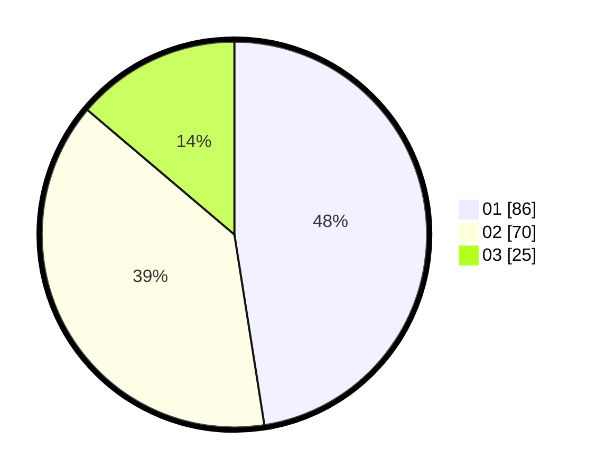

# Hasil

Hasil perolehan suara paslon dapat dilihat pada file paslon-01.txt, paslon-02.txt, dan paslon-03.txt.

Jika tidak ada, artinya data tersebut belum ada pada SIREKAP.

## Perolehan Suara

 * Paslon 01: **86**.
 * Paslon 02: **70**.
 * Paslon 03: **25**.

## Foto C Plano

https://sirekap-obj-formc.kpu.go.id/ca1c/pemilu/ppwp/31/74/09/10/04/3174091004053-20240216-020232--feba5b00-eeea-4968-ac18-a1c0ce196efd.jpg

https://sirekap-obj-formc.kpu.go.id/ca1c/pemilu/ppwp/31/74/09/10/04/3174091004053-20240216-020233--3a6f223d-60a3-4863-a393-3b862fa27a73.jpg

https://sirekap-obj-formc.kpu.go.id/ca1c/pemilu/ppwp/31/74/09/10/04/3174091004053-20240216-020233--29f94eb3-a79e-4bbe-af8c-9c006e8d34bd.jpg

## DATA PEMILIH TETAP

Jumlah pemilih dalam DPT: **173**.
 * L: **76**.
 * P: **97**.

## DATA PENGGUNA HAK PILIH

Jumlah pengguna hak pilih dalam DPT: **173**.
 * L: **76**.
 * P: **97**.

Jumlah pengguna hak pilih dalam DPTb: **6**.
 * L: **6**.
 * P: **0**.

Jumlah pengguna hak pilih dalam DPK: **4**.
 * L: **1**.
 * P: **3**.

Jumlah pengguna hak pilih: **183**.
 * L: **83**.
 * P: **100**.

## JUMLAH SUARA SAH DAN TIDAK SAH

JUMLAH SELURUH SUARA SAH: **181**.

JUMLAH SUARA TIDAK SAH: **2**.

JUMLAH SELURUH SUARA SAH DAN SUARA TIDAK SAH: **183**.
