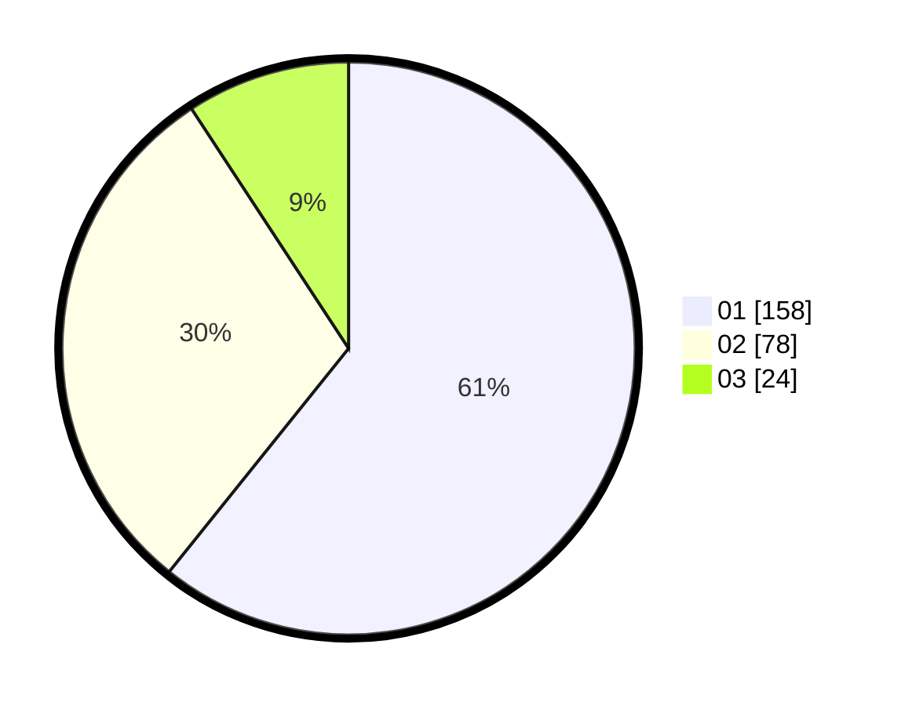

# Hasil

Hasil perolehan suara paslon dapat dilihat pada file paslon-01.txt, paslon-02.txt, dan paslon-03.txt.

Jika tidak ada, artinya data tersebut belum ada pada SIREKAP.

## Perolehan Suara

 * Paslon 01: **158**.
 * Paslon 02: **78**.
 * Paslon 03: **24**.

## Foto C Plano

https://sirekap-obj-formc.kpu.go.id/eb45/pemilu/ppwp/31/74/09/10/04/3174091004055-20240215-013752--c98152f1-e579-45d4-acd8-2b2e0b60779b.jpg

https://sirekap-obj-formc.kpu.go.id/eb45/pemilu/ppwp/31/74/09/10/04/3174091004055-20240215-013905--d6a0061b-9ef9-43a8-a2c2-49403c3a45eb.jpg

https://sirekap-obj-formc.kpu.go.id/eb45/pemilu/ppwp/31/74/09/10/04/3174091004055-20240215-014020--9fa5ec2c-25c8-4607-8661-a7aa383d09b3.jpg

## DATA PEMILIH TETAP

Jumlah pemilih dalam DPT: **290**.
 * L: **143**.
 * P: **147**.

## DATA PENGGUNA HAK PILIH

Jumlah pengguna hak pilih dalam DPT: **253**.
 * L: **124**.
 * P: **129**.

Jumlah pengguna hak pilih dalam DPTb: **11**.
 * L: **7**.
 * P: **4**.

Jumlah pengguna hak pilih dalam DPK: **0**.
 * L: **0**.
 * P: **0**.

Jumlah pengguna hak pilih: **254**.
 * L: **131**.
 * P: **133**.

## JUMLAH SUARA SAH DAN TIDAK SAH

JUMLAH SELURUH SUARA SAH: **260**.

JUMLAH SUARA TIDAK SAH: **4**.

JUMLAH SELURUH SUARA SAH DAN SUARA TIDAK SAH: **264**.
