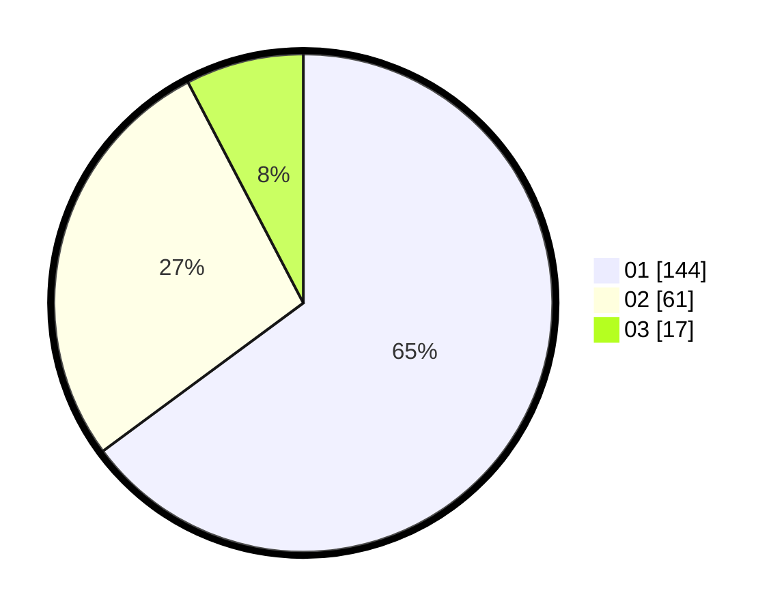

# Hasil

Hasil perolehan suara paslon dapat dilihat pada file paslon-01.txt, paslon-02.txt, dan paslon-03.txt.

Jika tidak ada, artinya data tersebut belum ada pada SIREKAP.

## Perolehan Suara

 * Paslon 01: **144**.
 * Paslon 02: **61**.
 * Paslon 03: **17**.

## Foto C Plano

https://sirekap-obj-formc.kpu.go.id/c306/pemilu/ppwp/31/74/09/10/04/3174091004064-20240217-162343--136ff089-a54b-4335-afd3-b2d22fe4f64a.jpg

https://sirekap-obj-formc.kpu.go.id/c306/pemilu/ppwp/31/74/09/10/04/3174091004064-20240214-160128--4542c580-e120-4f14-acd4-2a22536bd03e.jpg

https://sirekap-obj-formc.kpu.go.id/c306/pemilu/ppwp/31/74/09/10/04/3174091004064-20240215-032650--2927e3dc-a58e-43d3-8133-7272c57de778.jpg
