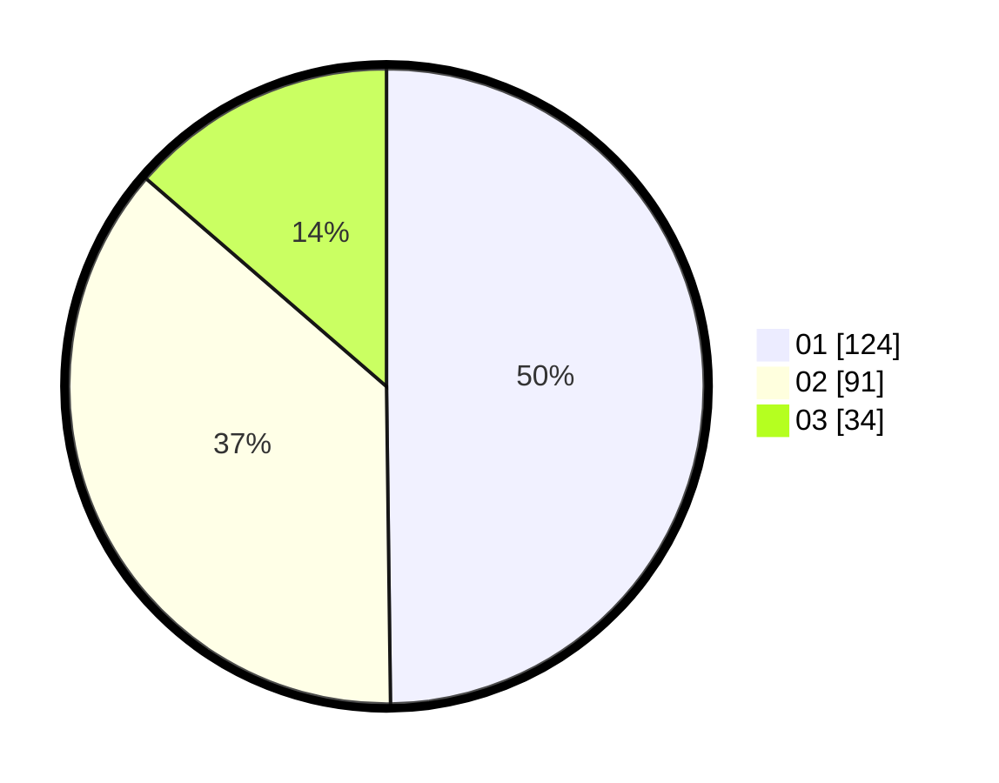

# Hasil

Hasil perolehan suara paslon dapat dilihat pada file paslon-01.txt, paslon-02.txt, dan paslon-03.txt.

Jika tidak ada, artinya data tersebut belum ada pada SIREKAP.

## Perolehan Suara

 * Paslon 01: **124**.
 * Paslon 02: **91**.
 * Paslon 03: **34**.

## Foto C Plano

https://sirekap-obj-formc.kpu.go.id/2bb8/pemilu/ppwp/31/74/09/10/04/3174091004070-20240215-052149--370b11e6-426f-472b-a0d1-c6c2a1a0c913.jpg

https://sirekap-obj-formc.kpu.go.id/2bb8/pemilu/ppwp/31/74/09/10/04/3174091004070-20240215-052402--f9e877f0-a798-4668-96e3-b32b2b4a9fe4.jpg

https://sirekap-obj-formc.kpu.go.id/2bb8/pemilu/ppwp/31/74/09/10/04/3174091004070-20240215-052549--92edb17a-e609-46de-8186-7aebb98cf930.jpg
