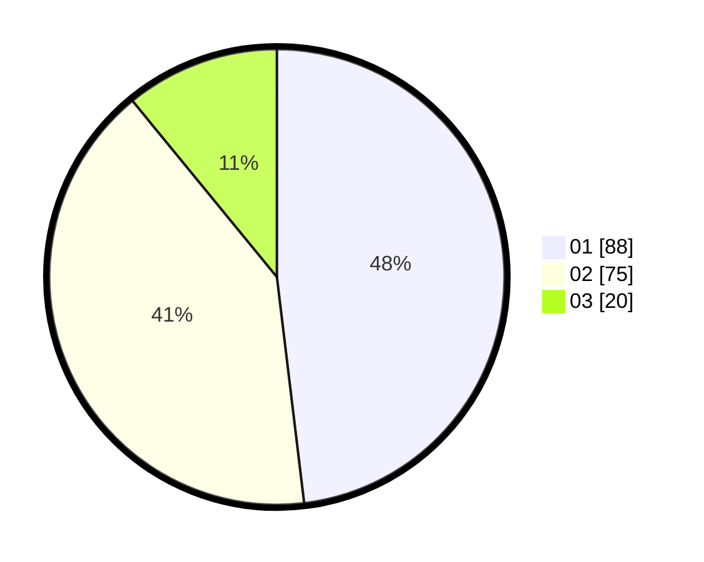

# Hasil

Hasil perolehan suara paslon dapat dilihat pada file paslon-01.txt, paslon-02.txt, dan paslon-03.txt.

Jika tidak ada, artinya data tersebut belum ada pada SIREKAP.

## Perolehan Suara

 * Paslon 01: **88**.
 * Paslon 02: **75**.
 * Paslon 03: **20**.

## Foto C Plano

https://sirekap-obj-formc.kpu.go.id/cbd2/pemilu/ppwp/31/74/09/10/04/3174091004073-20240214-215320--930936d0-f4cf-42c7-8fd5-73f0a98ee776.jpg

https://sirekap-obj-formc.kpu.go.id/cbd2/pemilu/ppwp/31/74/09/10/04/3174091004073-20240215-224441--fe7cdada-a608-4be3-8007-55a0d79efddd.jpg

https://sirekap-obj-formc.kpu.go.id/cbd2/pemilu/ppwp/31/74/09/10/04/3174091004073-20240214-220233--6d0bbd15-bf08-436d-b999-9bac89ecccc1.jpg

## DATA PEMILIH TETAP

Jumlah pemilih dalam DPT: **219**.
 * L: **111**.
 * P: **108**.

## DATA PENGGUNA HAK PILIH

Jumlah pengguna hak pilih dalam DPT: **177**.
 * L: **85**.
 * P: **92**.

Jumlah pengguna hak pilih dalam DPTb: **9**.
 * L: **4**.
 * P: **5**.

Jumlah pengguna hak pilih dalam DPK: **0**.
 * L: **0**.
 * P: **0**.

Jumlah pengguna hak pilih: **186**.
 * L: **89**.
 * P: **97**.

## JUMLAH SUARA SAH DAN TIDAK SAH

JUMLAH SELURUH SUARA SAH: **183**.

JUMLAH SUARA TIDAK SAH: **3**.

JUMLAH SELURUH SUARA SAH DAN SUARA TIDAK SAH: **186**.
