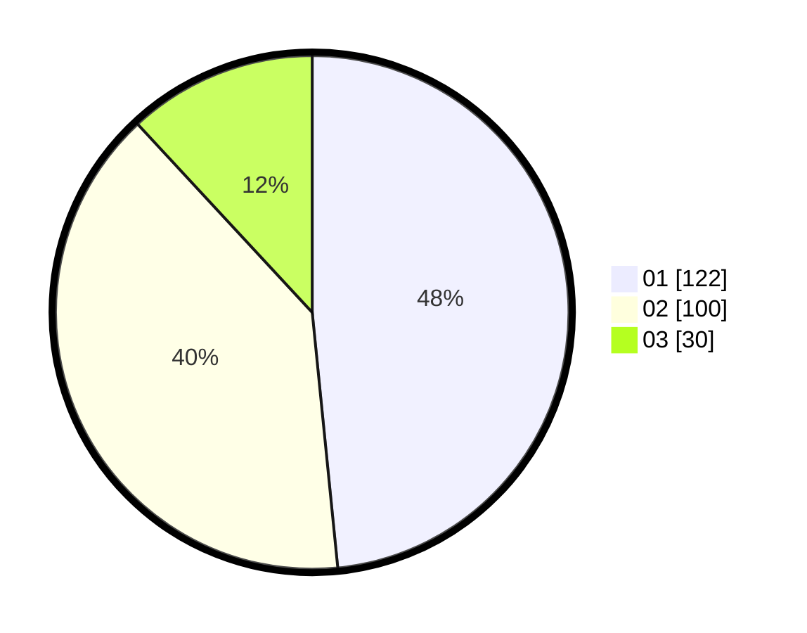

# Hasil

Hasil perolehan suara paslon dapat dilihat pada file paslon-01.txt, paslon-02.txt, dan paslon-03.txt.

Jika tidak ada, artinya data tersebut belum ada pada SIREKAP.

## Perolehan Suara

 * Paslon 01: **122**.
 * Paslon 02: **100**.
 * Paslon 03: **30**.

## Foto C Plano

https://sirekap-obj-formc.kpu.go.id/d1cd/pemilu/ppwp/31/74/09/10/04/3174091004076-20240216-045608--2fb0ba0e-cf22-43c4-8064-9480a5eb7a05.jpg

https://sirekap-obj-formc.kpu.go.id/d1cd/pemilu/ppwp/31/74/09/10/04/3174091004076-20240216-050206--a4451a46-fa84-4ce8-b9a2-017fc8dc330b.jpg

https://sirekap-obj-formc.kpu.go.id/d1cd/pemilu/ppwp/31/74/09/10/04/3174091004076-20240216-050237--a2c8bb84-77b9-475a-80a2-f526f7803322.jpg

## DATA PEMILIH TETAP

Jumlah pemilih dalam DPT: **299**.
 * L: **146**.
 * P: **153**.

## DATA PENGGUNA HAK PILIH

Jumlah pengguna hak pilih dalam DPT: **247**.
 * L: **114**.
 * P: **133**.

Jumlah pengguna hak pilih dalam DPTb: **4**.
 * L: **3**.
 * P: **1**.

Jumlah pengguna hak pilih dalam DPK: **2**.
 * L: **2**.
 * P: **0**.

Jumlah pengguna hak pilih: **253**.
 * L: **119**.
 * P: **134**.

## JUMLAH SUARA SAH DAN TIDAK SAH

JUMLAH SELURUH SUARA SAH: **252**.

JUMLAH SUARA TIDAK SAH: **1**.

JUMLAH SELURUH SUARA SAH DAN SUARA TIDAK SAH: **253**.
