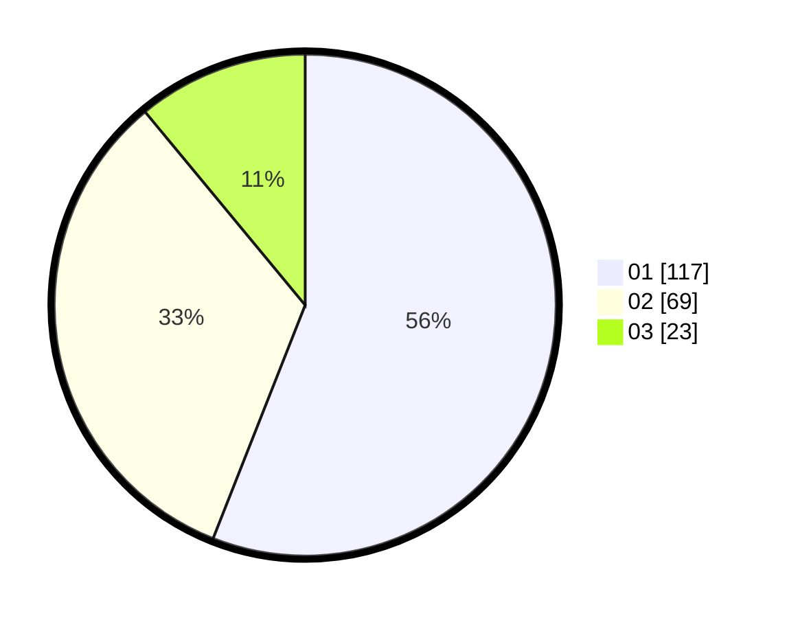

# Hasil

Hasil perolehan suara paslon dapat dilihat pada file paslon-01.txt, paslon-02.txt, dan paslon-03.txt.

Jika tidak ada, artinya data tersebut belum ada pada SIREKAP.

## Perolehan Suara

 * Paslon 01: **117**.
 * Paslon 02: **69**.
 * Paslon 03: **23**.

## Foto C Plano

https://sirekap-obj-formc.kpu.go.id/b032/pemilu/ppwp/31/74/09/10/04/3174091004086-20240216-151807--7db8eded-0aba-4e58-8c13-0bb3dc6e5258.jpg

https://sirekap-obj-formc.kpu.go.id/b032/pemilu/ppwp/31/74/09/10/04/3174091004086-20240216-132005--1290151e-6c7d-4e3b-9087-6b37b278aeda.jpg

https://sirekap-obj-formc.kpu.go.id/b032/pemilu/ppwp/31/74/09/10/04/3174091004086-20240216-132010--92577828-1311-4889-8073-a732e50b2e63.jpg
