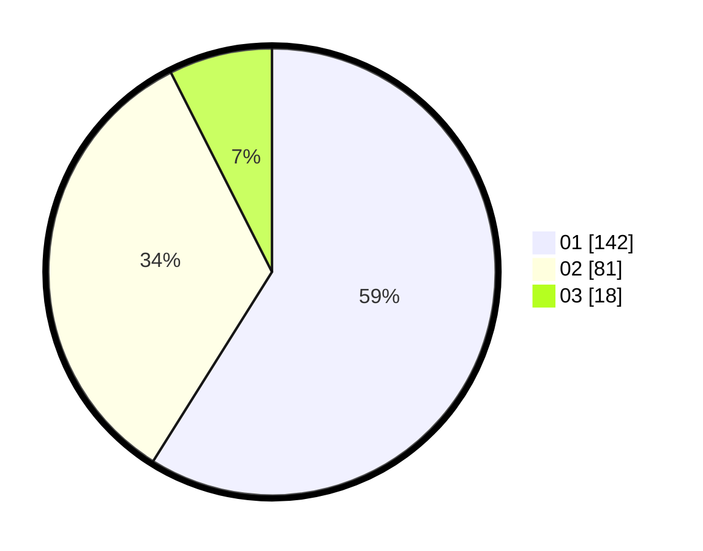

# Hasil

Hasil perolehan suara paslon dapat dilihat pada file paslon-01.txt, paslon-02.txt, dan paslon-03.txt.

Jika tidak ada, artinya data tersebut belum ada pada SIREKAP.

## Perolehan Suara

 * Paslon 01: **142**.
 * Paslon 02: **81**.
 * Paslon 03: **18**.

## Foto C Plano

https://sirekap-obj-formc.kpu.go.id/f076/pemilu/ppwp/31/74/09/10/04/3174091004092-20240214-202036--3ac3f0e8-ad11-4986-99c6-5ffe9094432c.jpg

https://sirekap-obj-formc.kpu.go.id/f076/pemilu/ppwp/31/74/09/10/04/3174091004092-20240214-202329--bf8bc6fc-a511-4285-993c-6d85e539ddee.jpg

https://sirekap-obj-formc.kpu.go.id/f076/pemilu/ppwp/31/74/09/10/04/3174091004092-20240215-010804--1fd61ad7-2eb4-4a88-a7fd-85724f636d5d.jpg

## DATA PEMILIH TETAP

Jumlah pemilih dalam DPT: **278**.
 * L: **132**.
 * P: **146**.

## DATA PENGGUNA HAK PILIH

Jumlah pengguna hak pilih dalam DPT: **237**.
 * L: **108**.
 * P: **129**.

Jumlah pengguna hak pilih dalam DPTb: **0**.
 * L: **0**.
 * P: **0**.

Jumlah pengguna hak pilih dalam DPK: **3**.
 * L: **1**.
 * P: **2**.

Jumlah pengguna hak pilih: **240**.
 * L: **109**.
 * P: **131**.

## JUMLAH SUARA SAH DAN TIDAK SAH

JUMLAH SELURUH SUARA SAH: **241**.

JUMLAH SUARA TIDAK SAH: **1**.

JUMLAH SELURUH SUARA SAH DAN SUARA TIDAK SAH: **242**.
