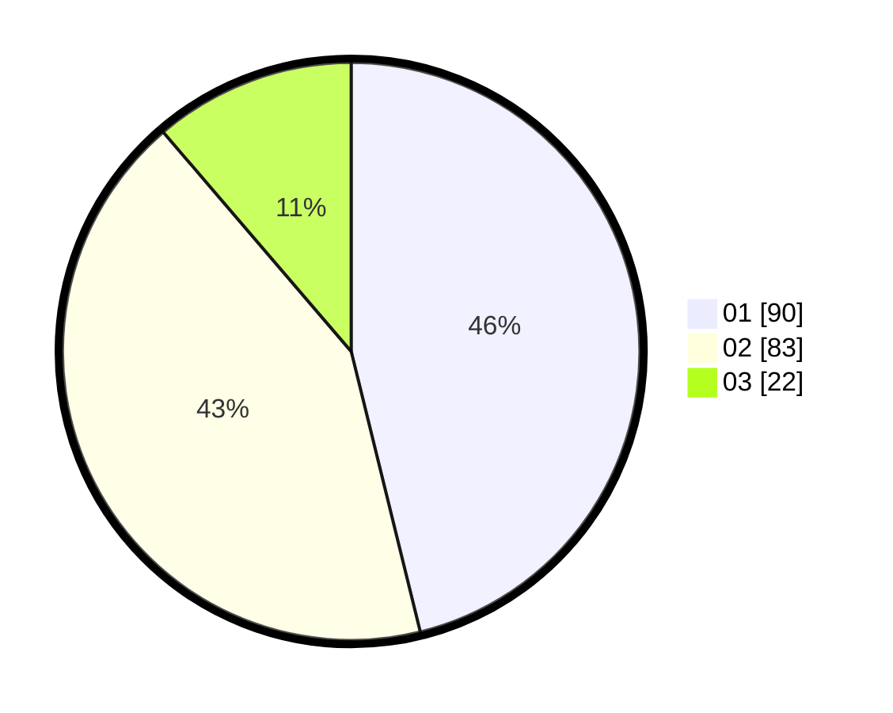

# Hasil

Hasil perolehan suara paslon dapat dilihat pada file paslon-01.txt, paslon-02.txt, dan paslon-03.txt.

Jika tidak ada, artinya data tersebut belum ada pada SIREKAP.

## Perolehan Suara

 * Paslon 01: **90**.
 * Paslon 02: **83**.
 * Paslon 03: **22**.

## Foto C Plano

https://sirekap-obj-formc.kpu.go.id/6a97/pemilu/ppwp/31/74/09/10/04/3174091004102-20240216-141844--3a025a46-1b10-4e14-b37f-47cd2820c195.jpg

https://sirekap-obj-formc.kpu.go.id/6a97/pemilu/ppwp/31/74/09/10/04/3174091004102-20240216-141846--40cbdeee-e6af-4fe1-8ec9-2b2891a2e085.jpg

https://sirekap-obj-formc.kpu.go.id/6a97/pemilu/ppwp/31/74/09/10/04/3174091004102-20240216-141845--3216bde7-9342-40c7-b8a0-87719d291baa.jpg

## DATA PEMILIH TETAP

Jumlah pemilih dalam DPT: **221**.
 * L: **124**.
 * P: **97**.

## DATA PENGGUNA HAK PILIH

Jumlah pengguna hak pilih dalam DPT: **193**.
 * L: **106**.
 * P: **87**.

Jumlah pengguna hak pilih dalam DPTb: **2**.
 * L: **1**.
 * P: **1**.

Jumlah pengguna hak pilih dalam DPK: **0**.
 * L: **0**.
 * P: **0**.

Jumlah pengguna hak pilih: **195**.
 * L: **107**.
 * P: **88**.

## JUMLAH SUARA SAH DAN TIDAK SAH

JUMLAH SELURUH SUARA SAH: **195**.

JUMLAH SUARA TIDAK SAH: **0**.

JUMLAH SELURUH SUARA SAH DAN SUARA TIDAK SAH: **195**.
