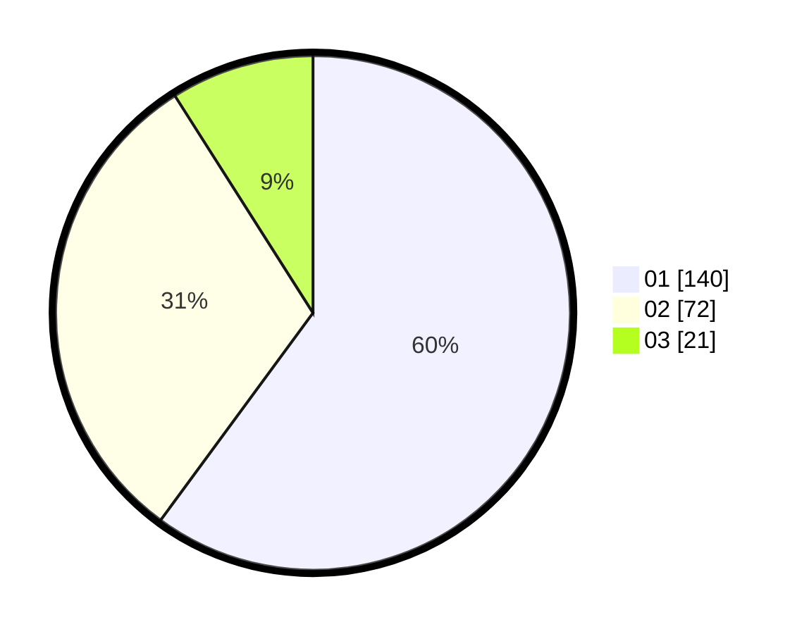

# Hasil

Hasil perolehan suara paslon dapat dilihat pada file paslon-01.txt, paslon-02.txt, dan paslon-03.txt.

Jika tidak ada, artinya data tersebut belum ada pada SIREKAP.

## Perolehan Suara

 * Paslon 01: **140**.
 * Paslon 02: **72**.
 * Paslon 03: **21**.

## Foto C Plano

https://sirekap-obj-formc.kpu.go.id/8cc1/pemilu/ppwp/31/74/09/10/04/3174091004106-20240214-160101--e62641ad-4c16-4211-9253-edebb67a8b4e.jpg

https://sirekap-obj-formc.kpu.go.id/8cc1/pemilu/ppwp/31/74/09/10/04/3174091004106-20240214-155426--44a71a2e-9d30-45de-ad36-6ce829abcaaf.jpg

https://sirekap-obj-formc.kpu.go.id/8cc1/pemilu/ppwp/31/74/09/10/04/3174091004106-20240214-155550--87996fa4-e0fd-447c-8bba-775b55f3027c.jpg

## DATA PEMILIH TETAP

Jumlah pemilih dalam DPT: **268**.
 * L: **151**.
 * P: **117**.

## DATA PENGGUNA HAK PILIH

Jumlah pengguna hak pilih dalam DPT: **233**.
 * L: **116**.
 * P: **117**.

Jumlah pengguna hak pilih dalam DPTb: **0**.
 * L: **0**.
 * P: **0**.

Jumlah pengguna hak pilih dalam DPK: **4**.
 * L: **1**.
 * P: **3**.

Jumlah pengguna hak pilih: **237**.
 * L: **117**.
 * P: **120**.

## JUMLAH SUARA SAH DAN TIDAK SAH

JUMLAH SELURUH SUARA SAH: **233**.

JUMLAH SUARA TIDAK SAH: **4**.

JUMLAH SELURUH SUARA SAH DAN SUARA TIDAK SAH: **237**.
