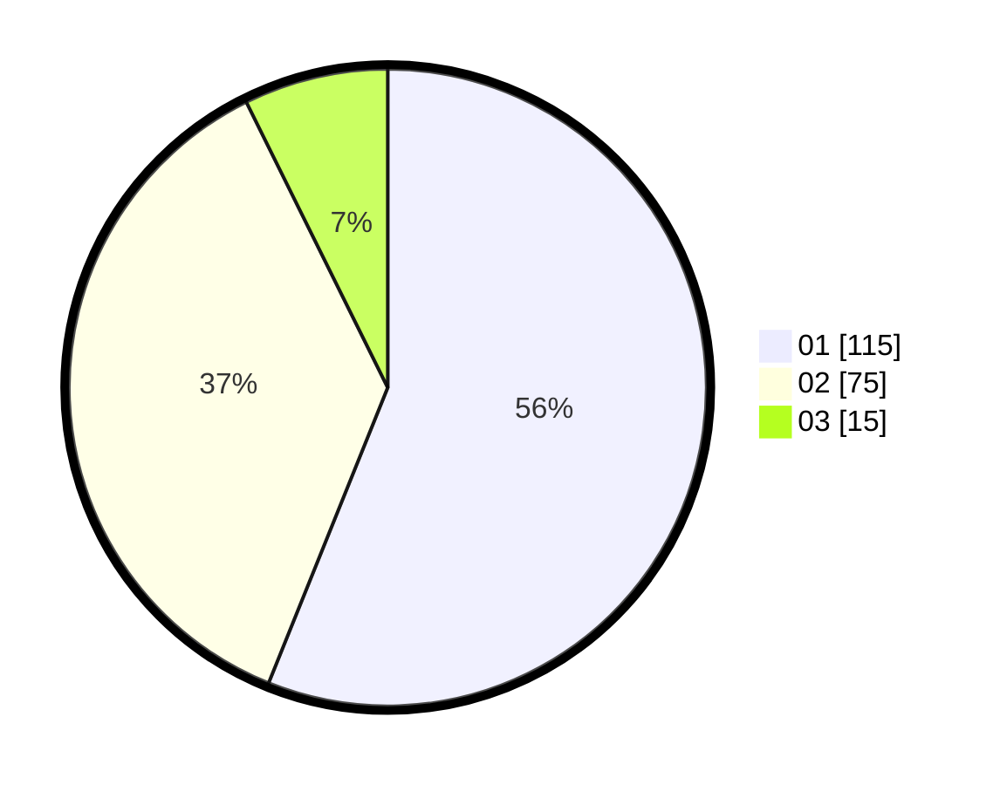

# Hasil

Hasil perolehan suara paslon dapat dilihat pada file paslon-01.txt, paslon-02.txt, dan paslon-03.txt.

Jika tidak ada, artinya data tersebut belum ada pada SIREKAP.

## Perolehan Suara

 * Paslon 01: **115**.
 * Paslon 02: **75**.
 * Paslon 03: **15**.

## Foto C Plano

https://sirekap-obj-formc.kpu.go.id/4185/pemilu/ppwp/31/74/09/10/04/3174091004113-20240215-002720--486eebbc-1eec-43c9-b3b3-e55432c4871e.jpg

https://sirekap-obj-formc.kpu.go.id/4185/pemilu/ppwp/31/74/09/10/04/3174091004113-20240215-002927--459748dd-b7f1-4548-b53e-f5c0044dc322.jpg

https://sirekap-obj-formc.kpu.go.id/4185/pemilu/ppwp/31/74/09/10/04/3174091004113-20240217-083753--caf4eb41-1958-45ae-a040-bd1d00ca6cff.jpg

## DATA PEMILIH TETAP

Jumlah pemilih dalam DPT: **270**.
 * L: **129**.
 * P: **141**.

## DATA PENGGUNA HAK PILIH

Jumlah pengguna hak pilih dalam DPT: **208**.
 * L: **96**.
 * P: **112**.

Jumlah pengguna hak pilih dalam DPTb: **5**.
 * L: **0**.
 * P: **5**.

Jumlah pengguna hak pilih dalam DPK: **0**.
 * L: **0**.
 * P: **0**.

Jumlah pengguna hak pilih: **209**.
 * L: **96**.
 * P: **113**.

## JUMLAH SUARA SAH DAN TIDAK SAH

JUMLAH SELURUH SUARA SAH: **205**.

JUMLAH SUARA TIDAK SAH: **4**.

JUMLAH SELURUH SUARA SAH DAN SUARA TIDAK SAH: **209**.
