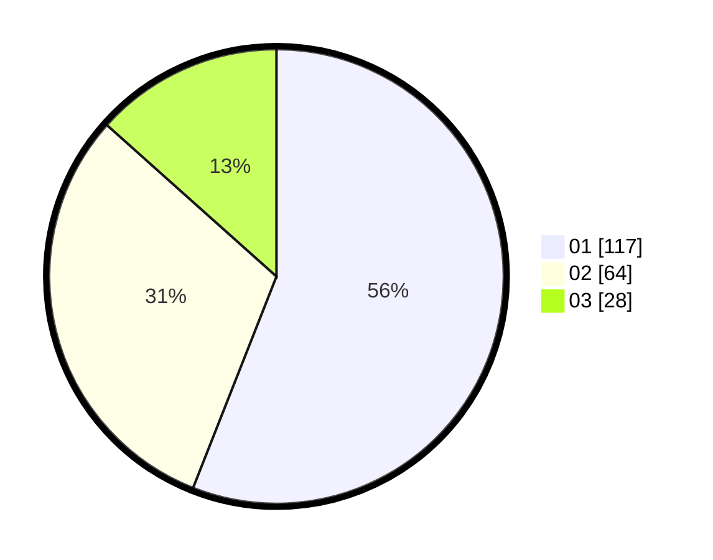

# Hasil

Hasil perolehan suara paslon dapat dilihat pada file paslon-01.txt, paslon-02.txt, dan paslon-03.txt.

Jika tidak ada, artinya data tersebut belum ada pada SIREKAP.

## Perolehan Suara

 * Paslon 01: **117**.
 * Paslon 02: **64**.
 * Paslon 03: **28**.

## Foto C Plano

https://sirekap-obj-formc.kpu.go.id/dabf/pemilu/ppwp/31/74/09/10/04/3174091004114-20240214-192003--a56f010f-6b09-4884-b22f-281143d26ddb.jpg

https://sirekap-obj-formc.kpu.go.id/dabf/pemilu/ppwp/31/74/09/10/04/3174091004114-20240214-193553--9f306b36-4e6b-4525-8ec9-ccdd342e3ab1.jpg

https://sirekap-obj-formc.kpu.go.id/dabf/pemilu/ppwp/31/74/09/10/04/3174091004114-20240214-203555--5d54c411-de08-42ea-bffa-56b8f3df0291.jpg

## DATA PEMILIH TETAP

Jumlah pemilih dalam DPT: **275**.
 * L: **126**.
 * P: **149**.

## DATA PENGGUNA HAK PILIH

Jumlah pengguna hak pilih dalam DPT: **213**.
 * L: **96**.
 * P: **117**.

Jumlah pengguna hak pilih dalam DPTb: **0**.
 * L: **0**.
 * P: **0**.

Jumlah pengguna hak pilih dalam DPK: **0**.
 * L: **0**.
 * P: **0**.

Jumlah pengguna hak pilih: **213**.
 * L: **96**.
 * P: **117**.

## JUMLAH SUARA SAH DAN TIDAK SAH

JUMLAH SELURUH SUARA SAH: **209**.

JUMLAH SUARA TIDAK SAH: **4**.

JUMLAH SELURUH SUARA SAH DAN SUARA TIDAK SAH: **213**.
