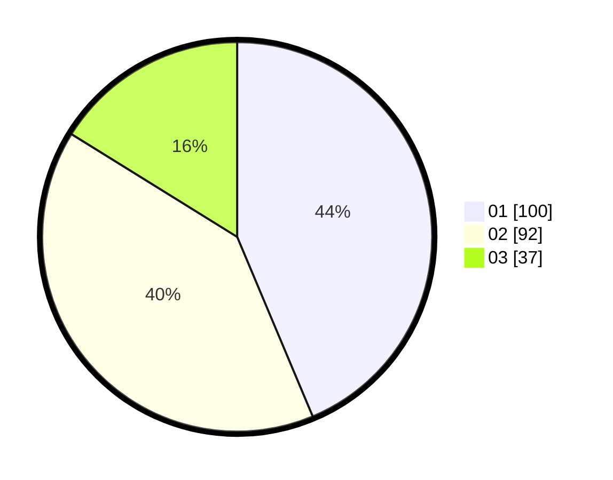

# Hasil

Hasil perolehan suara paslon dapat dilihat pada file paslon-01.txt, paslon-02.txt, dan paslon-03.txt.

Jika tidak ada, artinya data tersebut belum ada pada SIREKAP.

## Perolehan Suara

 * Paslon 01: **100**.
 * Paslon 02: **92**.
 * Paslon 03: **37**.

## Foto C Plano

https://sirekap-obj-formc.kpu.go.id/cc93/pemilu/ppwp/31/74/09/10/04/3174091004124-20240214-190427--9dc1879f-add9-4757-8900-b28890b8e4d1.jpg

https://sirekap-obj-formc.kpu.go.id/cc93/pemilu/ppwp/31/74/09/10/04/3174091004124-20240214-190437--3db185e5-0446-4cc6-90a5-eb7a10b78a41.jpg

https://sirekap-obj-formc.kpu.go.id/cc93/pemilu/ppwp/31/74/09/10/04/3174091004124-20240214-192825--6b1bca72-b9f1-49f0-a86b-7b3ef2f91461.jpg

## DATA PEMILIH TETAP

Jumlah pemilih dalam DPT: **300**.
 * L: **151**.
 * P: **149**.

## DATA PENGGUNA HAK PILIH

Jumlah pengguna hak pilih dalam DPT: **235**.
 * L: **116**.
 * P: **119**.

Jumlah pengguna hak pilih dalam DPTb: **0**.
 * L: **0**.
 * P: **0**.

Jumlah pengguna hak pilih dalam DPK: **2**.
 * L: **2**.
 * P: **0**.

Jumlah pengguna hak pilih: **237**.
 * L: **118**.
 * P: **119**.

## JUMLAH SUARA SAH DAN TIDAK SAH

JUMLAH SELURUH SUARA SAH: **229**.

JUMLAH SUARA TIDAK SAH: **8**.

JUMLAH SELURUH SUARA SAH DAN SUARA TIDAK SAH: **237**.
