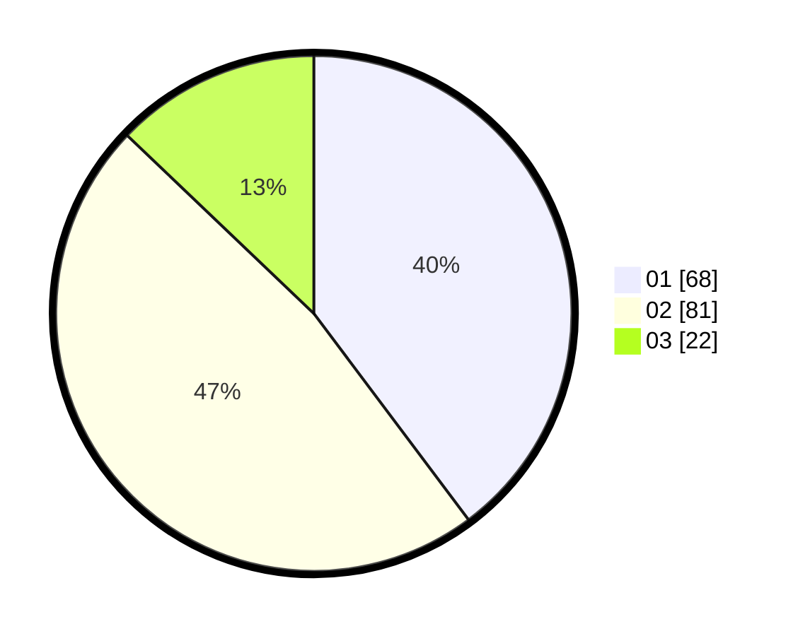

# Hasil

Hasil perolehan suara paslon dapat dilihat pada file paslon-01.txt, paslon-02.txt, dan paslon-03.txt.

Jika tidak ada, artinya data tersebut belum ada pada SIREKAP.

## Perolehan Suara

 * Paslon 01: **68**.
 * Paslon 02: **81**.
 * Paslon 03: **22**.

## Foto C Plano

https://sirekap-obj-formc.kpu.go.id/ab20/pemilu/ppwp/31/74/09/10/04/3174091004128-20240214-220329--f21974d5-b7c0-44bc-b395-9fe3996b3b92.jpg

https://sirekap-obj-formc.kpu.go.id/ab20/pemilu/ppwp/31/74/09/10/04/3174091004128-20240214-220031--b18d9271-e9a5-4469-9702-2909f3c2a5e0.jpg

https://sirekap-obj-formc.kpu.go.id/ab20/pemilu/ppwp/31/74/09/10/04/3174091004128-20240214-220519--f754912f-f00b-4a75-8ccf-a088f20586c8.jpg

## DATA PEMILIH TETAP

Jumlah pemilih dalam DPT: **206**.
 * L: **94**.
 * P: **112**.

## DATA PENGGUNA HAK PILIH

Jumlah pengguna hak pilih dalam DPT: **170**.
 * L: **75**.
 * P: **95**.

Jumlah pengguna hak pilih dalam DPTb: **2**.
 * L: **1**.
 * P: **1**.

Jumlah pengguna hak pilih dalam DPK: **0**.
 * L: **0**.
 * P: **0**.

Jumlah pengguna hak pilih: **172**.
 * L: **76**.
 * P: **96**.

## JUMLAH SUARA SAH DAN TIDAK SAH

JUMLAH SELURUH SUARA SAH: **171**.

JUMLAH SUARA TIDAK SAH: **1**.

JUMLAH SELURUH SUARA SAH DAN SUARA TIDAK SAH: **172**.
