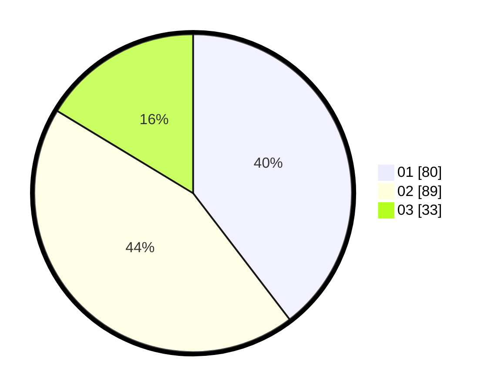

# Hasil

Hasil perolehan suara paslon dapat dilihat pada file paslon-01.txt, paslon-02.txt, dan paslon-03.txt.

Jika tidak ada, artinya data tersebut belum ada pada SIREKAP.

## Perolehan Suara

 * Paslon 01: **80**.
 * Paslon 02: **89**.
 * Paslon 03: **33**.

## Foto C Plano

https://sirekap-obj-formc.kpu.go.id/5628/pemilu/ppwp/31/74/09/10/04/3174091004150-20240214-211031--b1f7d224-f5cd-475c-913a-67d5d1445914.jpg

https://sirekap-obj-formc.kpu.go.id/5628/pemilu/ppwp/31/74/09/10/04/3174091004150-20240214-211230--2641dc3b-47c5-487b-9202-4a8900f30f86.jpg

https://sirekap-obj-formc.kpu.go.id/5628/pemilu/ppwp/31/74/09/10/04/3174091004150-20240214-224532--162de4bd-64f1-4e40-aab0-e18661e3b9ca.jpg

## DATA PEMILIH TETAP

Jumlah pemilih dalam DPT: **257**.
 * L: **135**.
 * P: **122**.

## DATA PENGGUNA HAK PILIH

Jumlah pengguna hak pilih dalam DPT: **204**.
 * L: **98**.
 * P: **106**.

Jumlah pengguna hak pilih dalam DPTb: **1**.
 * L: **1**.
 * P: **0**.

Jumlah pengguna hak pilih dalam DPK: **0**.
 * L: **0**.
 * P: **0**.

Jumlah pengguna hak pilih: **205**.
 * L: **99**.
 * P: **106**.

## JUMLAH SUARA SAH DAN TIDAK SAH

JUMLAH SELURUH SUARA SAH: **202**.

JUMLAH SUARA TIDAK SAH: **3**.

JUMLAH SELURUH SUARA SAH DAN SUARA TIDAK SAH: **205**.
