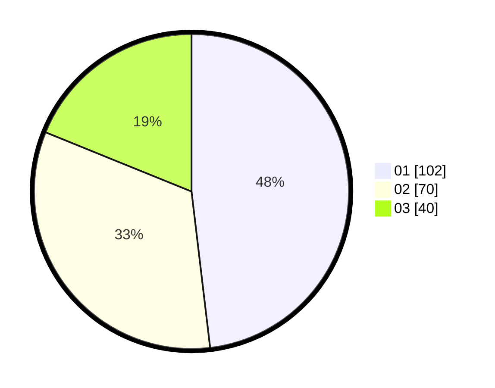

# Hasil

Hasil perolehan suara paslon dapat dilihat pada file paslon-01.txt, paslon-02.txt, dan paslon-03.txt.

Jika tidak ada, artinya data tersebut belum ada pada SIREKAP.

## Perolehan Suara

 * Paslon 01: **102**.
 * Paslon 02: **70**.
 * Paslon 03: **40**.

## Foto C Plano

https://sirekap-obj-formc.kpu.go.id/9dd1/pemilu/ppwp/31/74/09/10/04/3174091004152-20240214-195940--6a6efaf6-8772-4912-973c-53789332bef2.jpg

https://sirekap-obj-formc.kpu.go.id/9dd1/pemilu/ppwp/31/74/09/10/04/3174091004152-20240214-195952--0a24eb8e-6ce2-474d-9803-1701597a06d8.jpg

https://sirekap-obj-formc.kpu.go.id/9dd1/pemilu/ppwp/31/74/09/10/04/3174091004152-20240214-200002--24ea1268-1359-4720-95ef-3e792de0c8f0.jpg

## DATA PEMILIH TETAP

Jumlah pemilih dalam DPT: **241**.
 * L: **117**.
 * P: **124**.

## DATA PENGGUNA HAK PILIH

Jumlah pengguna hak pilih dalam DPT: **212**.
 * L: **106**.
 * P: **106**.

Jumlah pengguna hak pilih dalam DPTb: **3**.
 * L: **1**.
 * P: **2**.

Jumlah pengguna hak pilih dalam DPK: **0**.
 * L: **0**.
 * P: **0**.

Jumlah pengguna hak pilih: **215**.
 * L: **107**.
 * P: **108**.

## JUMLAH SUARA SAH DAN TIDAK SAH

JUMLAH SELURUH SUARA SAH: **212**.

JUMLAH SUARA TIDAK SAH: **3**.

JUMLAH SELURUH SUARA SAH DAN SUARA TIDAK SAH: **215**.
