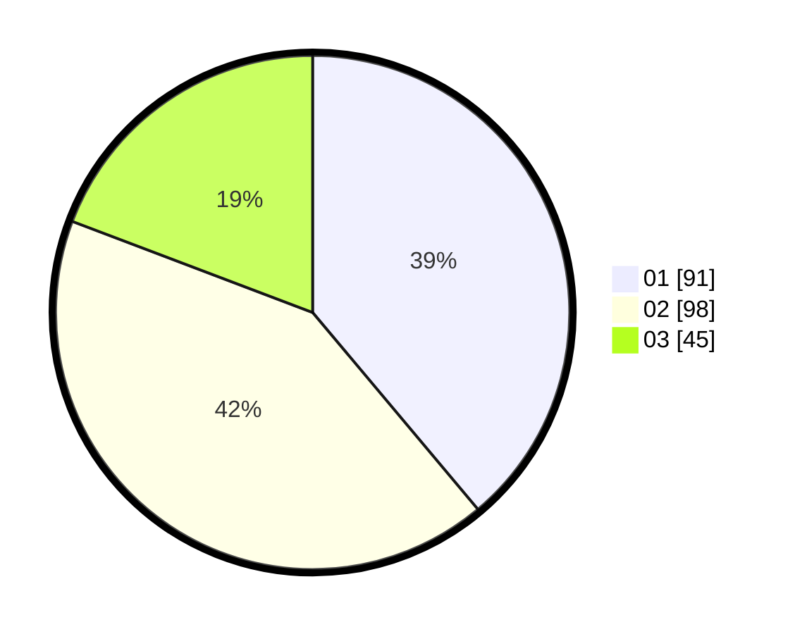

# Hasil

Hasil perolehan suara paslon dapat dilihat pada file paslon-01.txt, paslon-02.txt, dan paslon-03.txt.

Jika tidak ada, artinya data tersebut belum ada pada SIREKAP.

## Perolehan Suara

 * Paslon 01: **91**.
 * Paslon 02: **98**.
 * Paslon 03: **45**.

## Foto C Plano

https://sirekap-obj-formc.kpu.go.id/8ffe/pemilu/ppwp/31/74/09/10/04/3174091004164-20240214-202609--c73cb201-ab9a-4c05-bb8d-a8d4f90b60c4.jpg

https://sirekap-obj-formc.kpu.go.id/8ffe/pemilu/ppwp/31/74/09/10/04/3174091004164-20240214-210910--6f621392-2e00-4914-9fa5-11ba535c93f5.jpg

https://sirekap-obj-formc.kpu.go.id/8ffe/pemilu/ppwp/31/74/09/10/04/3174091004164-20240214-210648--4a8a8121-c861-431c-a625-f73474899da7.jpg

## DATA PEMILIH TETAP

Jumlah pemilih dalam DPT: **287**.
 * L: **140**.
 * P: **147**.

## DATA PENGGUNA HAK PILIH

Jumlah pengguna hak pilih dalam DPT: **234**.
 * L: **105**.
 * P: **129**.

Jumlah pengguna hak pilih dalam DPTb: **3**.
 * L: **2**.
 * P: **1**.

Jumlah pengguna hak pilih dalam DPK: **0**.
 * L: **0**.
 * P: **0**.

Jumlah pengguna hak pilih: **237**.
 * L: **107**.
 * P: **130**.

## JUMLAH SUARA SAH DAN TIDAK SAH

JUMLAH SELURUH SUARA SAH: **234**.

JUMLAH SUARA TIDAK SAH: **3**.

JUMLAH SELURUH SUARA SAH DAN SUARA TIDAK SAH: **237**.
