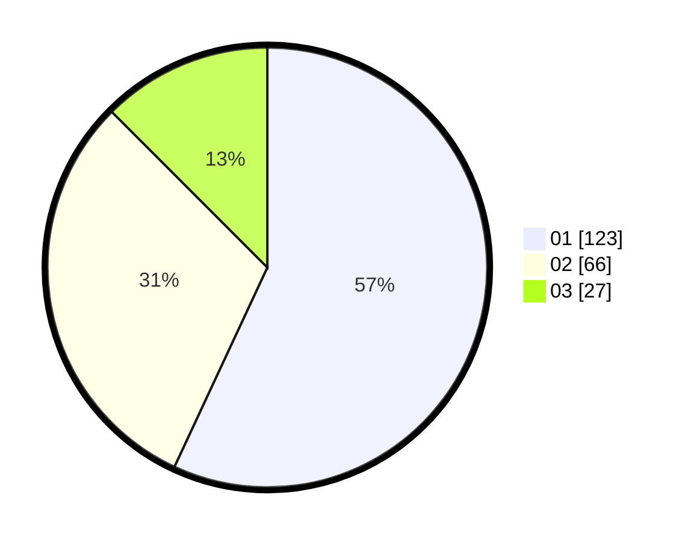

# Hasil

Hasil perolehan suara paslon dapat dilihat pada file paslon-01.txt, paslon-02.txt, dan paslon-03.txt.

Jika tidak ada, artinya data tersebut belum ada pada SIREKAP.

## Perolehan Suara

 * Paslon 01: **123**.
 * Paslon 02: **66**.
 * Paslon 03: **27**.

## Foto C Plano

https://sirekap-obj-formc.kpu.go.id/393f/pemilu/ppwp/31/74/09/10/04/3174091004168-20240215-002112--cc9a633a-8576-455a-95cf-2589120b2e56.jpg

https://sirekap-obj-formc.kpu.go.id/393f/pemilu/ppwp/31/74/09/10/04/3174091004168-20240214-203051--55c0e4e6-19c2-4bb3-a137-32398f9bade8.jpg

https://sirekap-obj-formc.kpu.go.id/393f/pemilu/ppwp/31/74/09/10/04/3174091004168-20240214-203148--921e041a-34b7-4085-b650-c58c86bffd88.jpg
