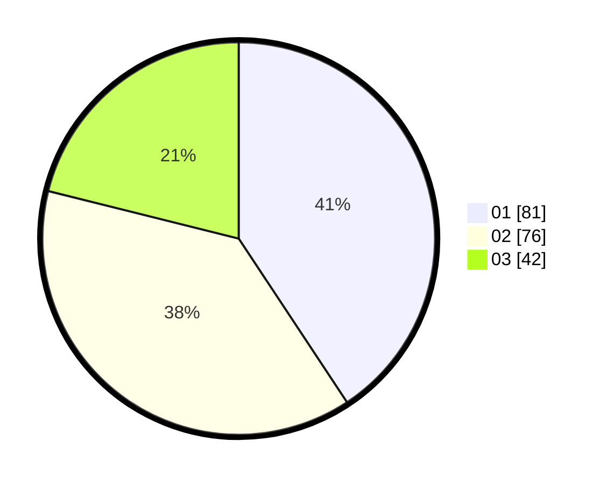

# Hasil

Hasil perolehan suara paslon dapat dilihat pada file paslon-01.txt, paslon-02.txt, dan paslon-03.txt.

Jika tidak ada, artinya data tersebut belum ada pada SIREKAP.

## Perolehan Suara

 * Paslon 01: **81**.
 * Paslon 02: **76**.
 * Paslon 03: **42**.

## Foto C Plano

https://sirekap-obj-formc.kpu.go.id/28c0/pemilu/ppwp/31/74/09/10/04/3174091004169-20240214-211117--4c470259-ef4d-4d82-a31e-f3cf07b02c9e.jpg

https://sirekap-obj-formc.kpu.go.id/28c0/pemilu/ppwp/31/74/09/10/04/3174091004169-20240214-204953--06dd6e2f-8a0f-4469-bae0-1ee59a979911.jpg

https://sirekap-obj-formc.kpu.go.id/28c0/pemilu/ppwp/31/74/09/10/04/3174091004169-20240214-205032--21c30b1f-507c-44ea-9f3b-01caa99847cb.jpg
