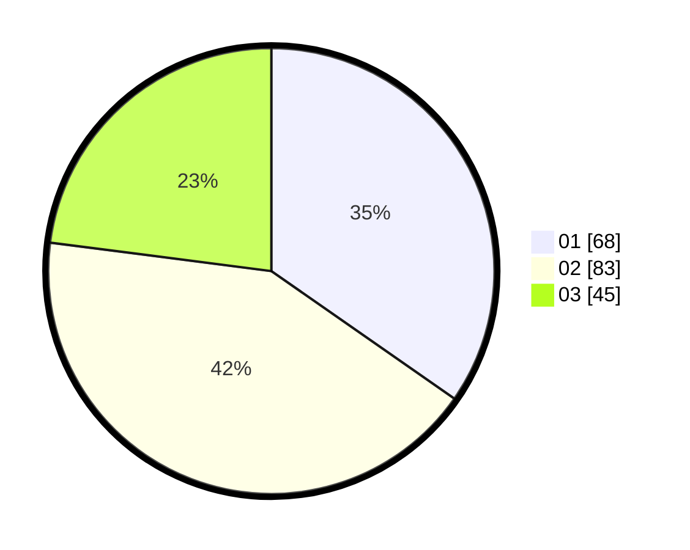

# Hasil

Hasil perolehan suara paslon dapat dilihat pada file paslon-01.txt, paslon-02.txt, dan paslon-03.txt.

Jika tidak ada, artinya data tersebut belum ada pada SIREKAP.

## Perolehan Suara

 * Paslon 01: **68**.
 * Paslon 02: **83**.
 * Paslon 03: **45**.

## Foto C Plano

https://sirekap-obj-formc.kpu.go.id/2d41/pemilu/ppwp/31/74/09/10/04/3174091004170-20240214-192145--211a28f8-ed40-44f5-ad7b-1413ce751a77.jpg

https://sirekap-obj-formc.kpu.go.id/2d41/pemilu/ppwp/31/74/09/10/04/3174091004170-20240214-192153--bde189ce-b3c2-4b67-8090-cb5a61600ea3.jpg

https://sirekap-obj-formc.kpu.go.id/2d41/pemilu/ppwp/31/74/09/10/04/3174091004170-20240214-192201--a5b7cd91-ce3b-4d2a-8838-e51a49216815.jpg

## DATA PEMILIH TETAP

Jumlah pemilih dalam DPT: **223**.
 * L: **104**.
 * P: **119**.

## DATA PENGGUNA HAK PILIH

Jumlah pengguna hak pilih dalam DPT: **195**.
 * L: **85**.
 * P: **110**.

Jumlah pengguna hak pilih dalam DPTb: **3**.
 * L: **1**.
 * P: **2**.

Jumlah pengguna hak pilih dalam DPK: **0**.
 * L: **0**.
 * P: **0**.

Jumlah pengguna hak pilih: **198**.
 * L: **86**.
 * P: **112**.

## JUMLAH SUARA SAH DAN TIDAK SAH

JUMLAH SELURUH SUARA SAH: **196**.

JUMLAH SUARA TIDAK SAH: **2**.

JUMLAH SELURUH SUARA SAH DAN SUARA TIDAK SAH: **198**.
