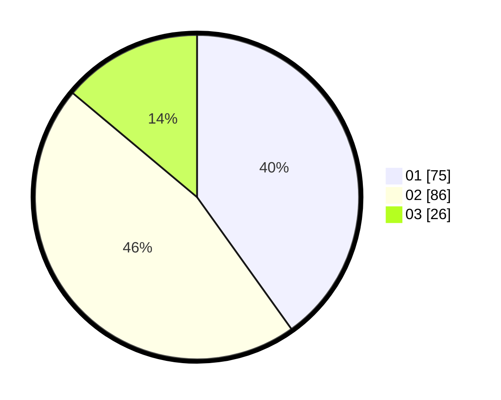

# Hasil

Hasil perolehan suara paslon dapat dilihat pada file paslon-01.txt, paslon-02.txt, dan paslon-03.txt.

Jika tidak ada, artinya data tersebut belum ada pada SIREKAP.

## Perolehan Suara

 * Paslon 01: **75**.
 * Paslon 02: **86**.
 * Paslon 03: **26**.

## Foto C Plano

https://sirekap-obj-formc.kpu.go.id/f9d7/pemilu/ppwp/31/74/09/10/04/3174091004186-20240215-213051--2c42f2bb-5279-4d7c-a820-b67fece7be9d.jpg

https://sirekap-obj-formc.kpu.go.id/f9d7/pemilu/ppwp/31/74/09/10/04/3174091004186-20240215-213135--983bef13-3a12-4446-83ae-82a2984b628d.jpg

https://sirekap-obj-formc.kpu.go.id/f9d7/pemilu/ppwp/31/74/09/10/04/3174091004186-20240215-014731--b70468e3-be53-4a89-99e7-1f23283027eb.jpg

## DATA PEMILIH TETAP

Jumlah pemilih dalam DPT: **223**.
 * L: **111**.
 * P: **112**.

## DATA PENGGUNA HAK PILIH

Jumlah pengguna hak pilih dalam DPT: **185**.
 * L: **92**.
 * P: **93**.

Jumlah pengguna hak pilih dalam DPTb: **3**.
 * L: **3**.
 * P: **0**.

Jumlah pengguna hak pilih dalam DPK: **2**.
 * L: **0**.
 * P: **2**.

Jumlah pengguna hak pilih: **190**.
 * L: **95**.
 * P: **95**.

## JUMLAH SUARA SAH DAN TIDAK SAH

JUMLAH SELURUH SUARA SAH: **187**.

JUMLAH SUARA TIDAK SAH: **3**.

JUMLAH SELURUH SUARA SAH DAN SUARA TIDAK SAH: **190**.
