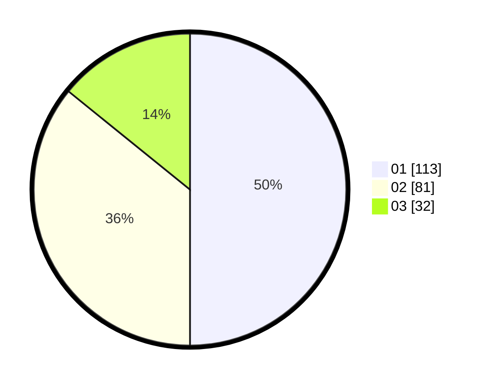

# Hasil

Hasil perolehan suara paslon dapat dilihat pada file paslon-01.txt, paslon-02.txt, dan paslon-03.txt.

Jika tidak ada, artinya data tersebut belum ada pada SIREKAP.

## Perolehan Suara

 * Paslon 01: **113**.
 * Paslon 02: **81**.
 * Paslon 03: **32**.

## Foto C Plano

https://sirekap-obj-formc.kpu.go.id/ec92/pemilu/ppwp/31/74/09/10/04/3174091004188-20240216-131939--0c388b6d-d445-486a-89ef-f2ddc4661ad9.jpg

https://sirekap-obj-formc.kpu.go.id/ec92/pemilu/ppwp/31/74/09/10/04/3174091004188-20240216-131941--3f7a933d-7559-45da-abc4-5697e5058c21.jpg

https://sirekap-obj-formc.kpu.go.id/ec92/pemilu/ppwp/31/74/09/10/04/3174091004188-20240216-131940--0557007d-4b2a-49a8-ae16-3b596d2e465d.jpg

## DATA PEMILIH TETAP

Jumlah pemilih dalam DPT: **262**.
 * L: **126**.
 * P: **136**.

## DATA PENGGUNA HAK PILIH

Jumlah pengguna hak pilih dalam DPT: **224**.
 * L: **107**.
 * P: **117**.

Jumlah pengguna hak pilih dalam DPTb: **3**.
 * L: **1**.
 * P: **2**.

Jumlah pengguna hak pilih dalam DPK: **0**.
 * L: **0**.
 * P: **0**.

Jumlah pengguna hak pilih: **227**.
 * L: **108**.
 * P: **119**.

## JUMLAH SUARA SAH DAN TIDAK SAH

JUMLAH SELURUH SUARA SAH: **226**.

JUMLAH SUARA TIDAK SAH: **1**.

JUMLAH SELURUH SUARA SAH DAN SUARA TIDAK SAH: **227**.
