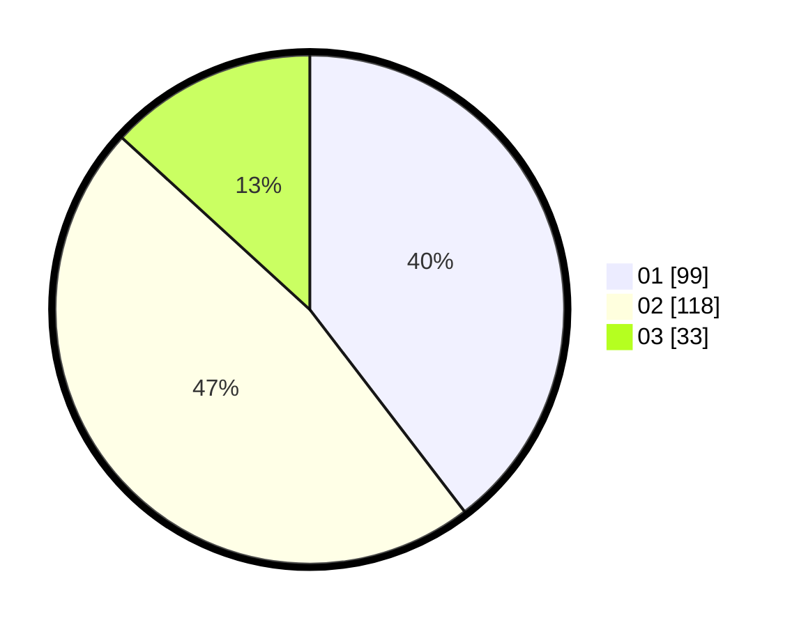

# Hasil

Hasil perolehan suara paslon dapat dilihat pada file paslon-01.txt, paslon-02.txt, dan paslon-03.txt.

Jika tidak ada, artinya data tersebut belum ada pada SIREKAP.

## Perolehan Suara

 * Paslon 01: **99**.
 * Paslon 02: **118**.
 * Paslon 03: **33**.

## Foto C Plano

https://sirekap-obj-formc.kpu.go.id/fcd5/pemilu/ppwp/31/74/09/10/05/3174091005001-20240217-110857--fbb9eecf-8c59-421d-bcca-1b34c00d2483.jpg

https://sirekap-obj-formc.kpu.go.id/fcd5/pemilu/ppwp/31/74/09/10/05/3174091005001-20240214-232906--b347c362-ff1c-4d2d-8f26-85f7e7b603bb.jpg

https://sirekap-obj-formc.kpu.go.id/fcd5/pemilu/ppwp/31/74/09/10/05/3174091005001-20240214-233031--c4f42374-2f1e-45d7-a589-588d62418f7c.jpg
