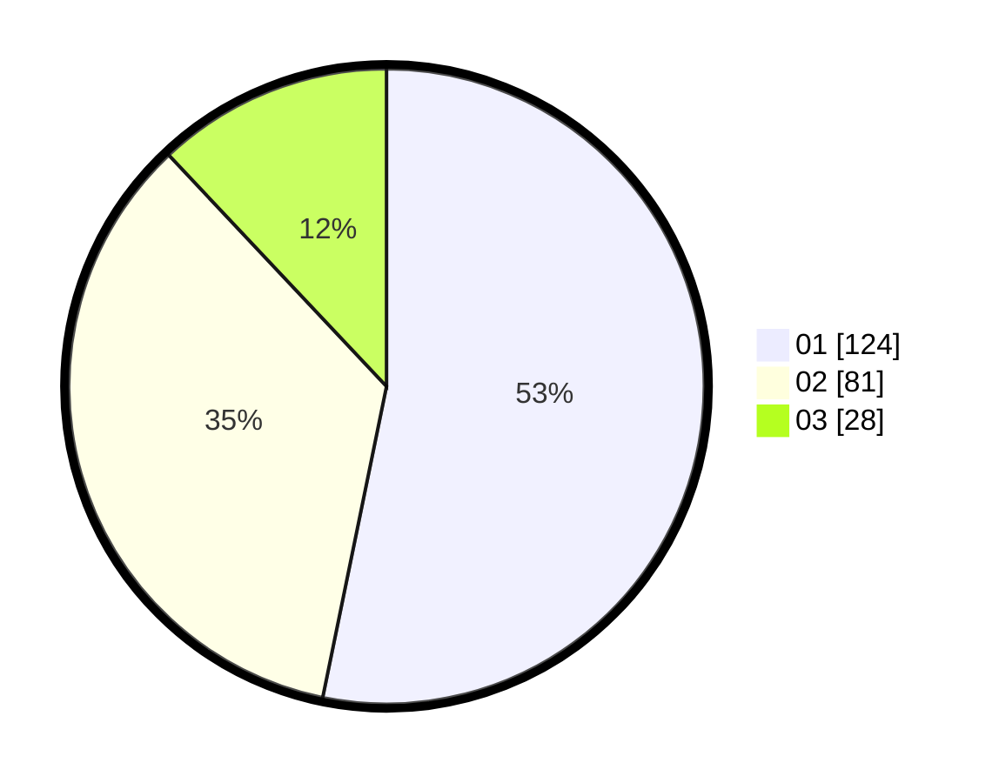

# Hasil

Hasil perolehan suara paslon dapat dilihat pada file paslon-01.txt, paslon-02.txt, dan paslon-03.txt.

Jika tidak ada, artinya data tersebut belum ada pada SIREKAP.

## Perolehan Suara

 * Paslon 01: **124**.
 * Paslon 02: **81**.
 * Paslon 03: **28**.

## Foto C Plano

https://sirekap-obj-formc.kpu.go.id/026d/pemilu/ppwp/31/74/09/10/05/3174091005008-20240216-225058--6f1fcf37-968d-4132-a7ba-5e5bbcc658b6.jpg

https://sirekap-obj-formc.kpu.go.id/026d/pemilu/ppwp/31/74/09/10/05/3174091005008-20240216-211655--191ac7aa-4b8b-4571-97aa-094b889040f0.jpg

https://sirekap-obj-formc.kpu.go.id/026d/pemilu/ppwp/31/74/09/10/05/3174091005008-20240216-211707--de27e19f-f39a-4989-830e-2ffa965c7d5c.jpg

## DATA PEMILIH TETAP

Jumlah pemilih dalam DPT: **255**.
 * L: **123**.
 * P: **132**.

## DATA PENGGUNA HAK PILIH

Jumlah pengguna hak pilih dalam DPT: **214**.
 * L: **89**.
 * P: **125**.

Jumlah pengguna hak pilih dalam DPTb: **15**.
 * L: **5**.
 * P: **10**.

Jumlah pengguna hak pilih dalam DPK: **6**.
 * L: **1**.
 * P: **5**.

Jumlah pengguna hak pilih: **235**.
 * L: **95**.
 * P: **140**.

## JUMLAH SUARA SAH DAN TIDAK SAH

JUMLAH SELURUH SUARA SAH: **233**.

JUMLAH SUARA TIDAK SAH: **2**.

JUMLAH SELURUH SUARA SAH DAN SUARA TIDAK SAH: **235**.
