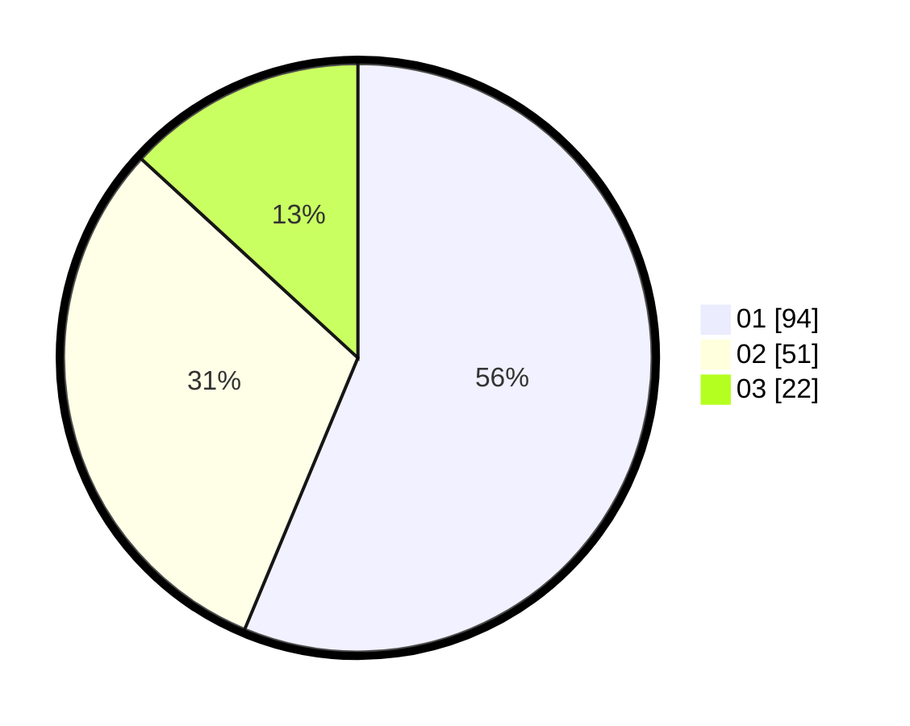

# Hasil

Hasil perolehan suara paslon dapat dilihat pada file paslon-01.txt, paslon-02.txt, dan paslon-03.txt.

Jika tidak ada, artinya data tersebut belum ada pada SIREKAP.

## Perolehan Suara

 * Paslon 01: **94**.
 * Paslon 02: **51**.
 * Paslon 03: **22**.

## Foto C Plano

https://sirekap-obj-formc.kpu.go.id/0c16/pemilu/ppwp/31/74/09/10/05/3174091005033-20240215-022052--b3befb36-5271-48fd-ba8c-4899b536da96.jpg

https://sirekap-obj-formc.kpu.go.id/0c16/pemilu/ppwp/31/74/09/10/05/3174091005033-20240215-022214--27998d59-ce68-4a36-bbe4-fb9ffa023e69.jpg

https://sirekap-obj-formc.kpu.go.id/0c16/pemilu/ppwp/31/74/09/10/05/3174091005033-20240215-022337--c0338d94-3b62-4568-9c23-b69de00f5fa1.jpg
