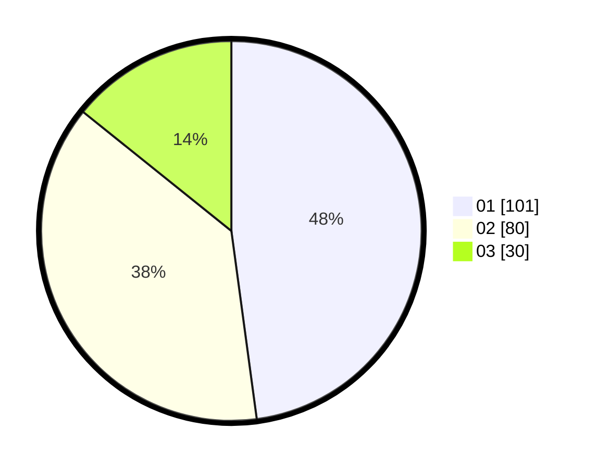

# Hasil

Hasil perolehan suara paslon dapat dilihat pada file paslon-01.txt, paslon-02.txt, dan paslon-03.txt.

Jika tidak ada, artinya data tersebut belum ada pada SIREKAP.

## Perolehan Suara

 * Paslon 01: **101**.
 * Paslon 02: **80**.
 * Paslon 03: **30**.

## Foto C Plano

https://sirekap-obj-formc.kpu.go.id/e453/pemilu/ppwp/31/74/09/10/05/3174091005038-20240216-095301--fd868c91-60fb-44f4-85fa-24ee0e4a6391.jpg

https://sirekap-obj-formc.kpu.go.id/e453/pemilu/ppwp/31/74/09/10/05/3174091005038-20240215-215642--11a1176a-9324-47c7-9f3f-e35a8ce36925.jpg

https://sirekap-obj-formc.kpu.go.id/e453/pemilu/ppwp/31/74/09/10/05/3174091005038-20240215-131039--e3f101b9-8a72-4b71-894c-acecbc736d45.jpg

## DATA PEMILIH TETAP

Jumlah pemilih dalam DPT: **252**.
 * L: **120**.
 * P: **132**.

## DATA PENGGUNA HAK PILIH

Jumlah pengguna hak pilih dalam DPT: **206**.
 * L: **98**.
 * P: **108**.

Jumlah pengguna hak pilih dalam DPTb: **1**.
 * L: **1**.
 * P: **0**.

Jumlah pengguna hak pilih dalam DPK: **4**.
 * L: **1**.
 * P: **3**.

Jumlah pengguna hak pilih: **211**.
 * L: **100**.
 * P: **111**.

## JUMLAH SUARA SAH DAN TIDAK SAH

JUMLAH SELURUH SUARA SAH: **211**.

JUMLAH SUARA TIDAK SAH: **0**.

JUMLAH SELURUH SUARA SAH DAN SUARA TIDAK SAH: **211**.
