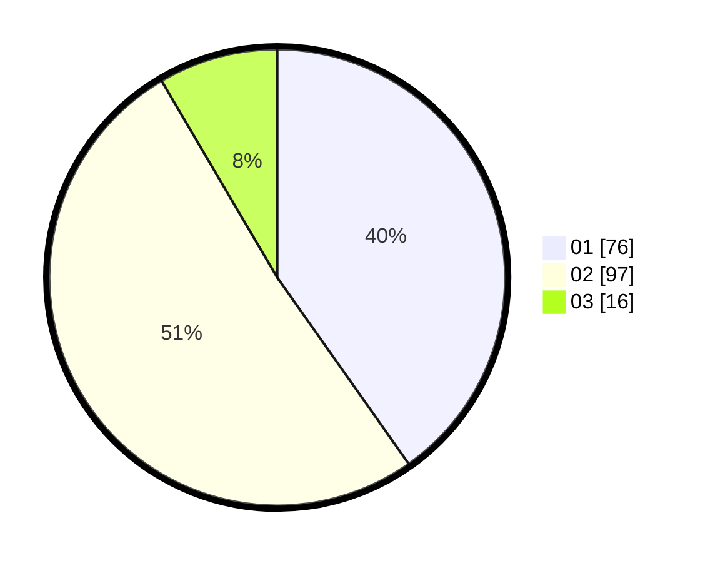

# Hasil

Hasil perolehan suara paslon dapat dilihat pada file paslon-01.txt, paslon-02.txt, dan paslon-03.txt.

Jika tidak ada, artinya data tersebut belum ada pada SIREKAP.

## Perolehan Suara

 * Paslon 01: **76**.
 * Paslon 02: **97**.
 * Paslon 03: **16**.

## Foto C Plano

https://sirekap-obj-formc.kpu.go.id/8e84/pemilu/ppwp/31/74/09/10/05/3174091005043-20240214-155146--5a20c15d-d7e3-4e3a-b493-8c580318eb54.jpg

https://sirekap-obj-formc.kpu.go.id/8e84/pemilu/ppwp/31/74/09/10/05/3174091005043-20240214-155333--14fd689b-d04d-4e29-a9f0-2c140593c379.jpg

https://sirekap-obj-formc.kpu.go.id/8e84/pemilu/ppwp/31/74/09/10/05/3174091005043-20240214-200611--a1c547c3-e7b6-4591-847a-52d38f93846e.jpg

## DATA PEMILIH TETAP

Jumlah pemilih dalam DPT: **232**.
 * L: **119**.
 * P: **113**.

## DATA PENGGUNA HAK PILIH

Jumlah pengguna hak pilih dalam DPT: **191**.
 * L: **96**.
 * P: **95**.

Jumlah pengguna hak pilih dalam DPTb: **0**.
 * L: **0**.
 * P: **0**.

Jumlah pengguna hak pilih dalam DPK: **0**.
 * L: **0**.
 * P: **0**.

Jumlah pengguna hak pilih: **191**.
 * L: **96**.
 * P: **95**.

## JUMLAH SUARA SAH DAN TIDAK SAH

JUMLAH SELURUH SUARA SAH: **189**.

JUMLAH SUARA TIDAK SAH: **2**.

JUMLAH SELURUH SUARA SAH DAN SUARA TIDAK SAH: **191**.
