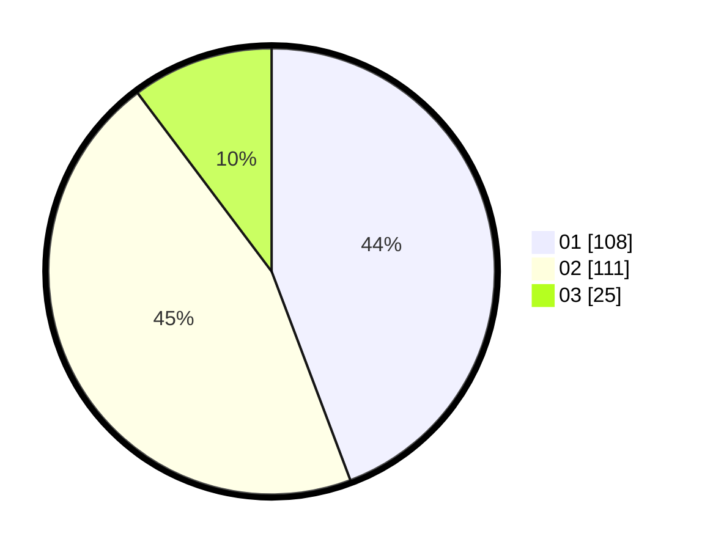

# Hasil

Hasil perolehan suara paslon dapat dilihat pada file paslon-01.txt, paslon-02.txt, dan paslon-03.txt.

Jika tidak ada, artinya data tersebut belum ada pada SIREKAP.

## Perolehan Suara

 * Paslon 01: **108**.
 * Paslon 02: **111**.
 * Paslon 03: **25**.

## Foto C Plano

https://sirekap-obj-formc.kpu.go.id/1a94/pemilu/ppwp/31/74/09/10/05/3174091005044-20240216-143606--72acf883-5e5b-4b60-a700-b8bb575d11d0.jpg

https://sirekap-obj-formc.kpu.go.id/1a94/pemilu/ppwp/31/74/09/10/05/3174091005044-20240216-143607--e02a7286-3b68-47ce-b326-62fa069d6251.jpg

https://sirekap-obj-formc.kpu.go.id/1a94/pemilu/ppwp/31/74/09/10/05/3174091005044-20240216-143606--7d6446e0-3adb-4a82-9379-ec55c837a637.jpg

## DATA PEMILIH TETAP

Jumlah pemilih dalam DPT: **281**.
 * L: **145**.
 * P: **136**.

## DATA PENGGUNA HAK PILIH

Jumlah pengguna hak pilih dalam DPT: **234**.
 * L: **117**.
 * P: **117**.

Jumlah pengguna hak pilih dalam DPTb: **6**.
 * L: **2**.
 * P: **4**.

Jumlah pengguna hak pilih dalam DPK: **6**.
 * L: **2**.
 * P: **4**.

Jumlah pengguna hak pilih: **246**.
 * L: **121**.
 * P: **125**.

## JUMLAH SUARA SAH DAN TIDAK SAH

JUMLAH SELURUH SUARA SAH: **244**.

JUMLAH SUARA TIDAK SAH: **2**.

JUMLAH SELURUH SUARA SAH DAN SUARA TIDAK SAH: **246**.
