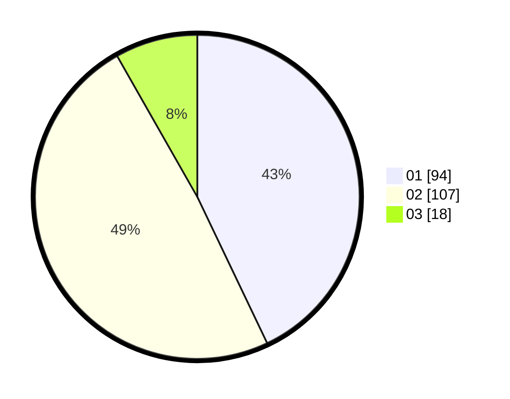

# Hasil

Hasil perolehan suara paslon dapat dilihat pada file paslon-01.txt, paslon-02.txt, dan paslon-03.txt.

Jika tidak ada, artinya data tersebut belum ada pada SIREKAP.

## Perolehan Suara

 * Paslon 01: **94**.
 * Paslon 02: **107**.
 * Paslon 03: **18**.

## Foto C Plano

https://sirekap-obj-formc.kpu.go.id/baa4/pemilu/ppwp/31/74/09/10/05/3174091005046-20240216-144321--fc5dba6f-e382-4f6a-8911-fa7626cc9946.jpg

https://sirekap-obj-formc.kpu.go.id/baa4/pemilu/ppwp/31/74/09/10/05/3174091005046-20240216-144322--b41c69ea-1953-4e71-b0c3-3f67bae0fd1b.jpg

https://sirekap-obj-formc.kpu.go.id/baa4/pemilu/ppwp/31/74/09/10/05/3174091005046-20240216-144322--16d49eee-7ce0-4302-a53f-245c32102d48.jpg

## DATA PEMILIH TETAP

Jumlah pemilih dalam DPT: **271**.
 * L: **134**.
 * P: **137**.

## DATA PENGGUNA HAK PILIH

Jumlah pengguna hak pilih dalam DPT: **217**.
 * L: **106**.
 * P: **111**.

Jumlah pengguna hak pilih dalam DPTb: **3**.
 * L: **1**.
 * P: **2**.

Jumlah pengguna hak pilih dalam DPK: **2**.
 * L: **0**.
 * P: **2**.

Jumlah pengguna hak pilih: **222**.
 * L: **107**.
 * P: **115**.

## JUMLAH SUARA SAH DAN TIDAK SAH

JUMLAH SELURUH SUARA SAH: **219**.

JUMLAH SUARA TIDAK SAH: **3**.

JUMLAH SELURUH SUARA SAH DAN SUARA TIDAK SAH: **222**.
