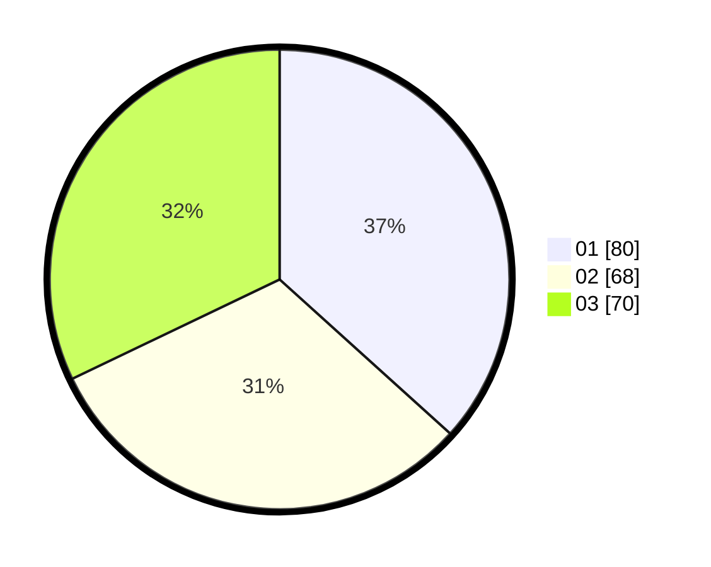

# Hasil

Hasil perolehan suara paslon dapat dilihat pada file paslon-01.txt, paslon-02.txt, dan paslon-03.txt.

Jika tidak ada, artinya data tersebut belum ada pada SIREKAP.

## Perolehan Suara

 * Paslon 01: **80**.
 * Paslon 02: **68**.
 * Paslon 03: **70**.

## Foto C Plano

https://sirekap-obj-formc.kpu.go.id/6fde/pemilu/ppwp/31/74/09/10/05/3174091005052-20240214-192034--f2a789a4-06ae-4e31-9773-653dc2a97dba.jpg

https://sirekap-obj-formc.kpu.go.id/6fde/pemilu/ppwp/31/74/09/10/05/3174091005052-20240214-192419--9d3ae3d6-e647-47a3-8cc5-eef7eb3beac7.jpg

https://sirekap-obj-formc.kpu.go.id/6fde/pemilu/ppwp/31/74/09/10/05/3174091005052-20240214-192106--e8d930e4-ac9d-4f6b-b181-3bf4107e4f93.jpg

## DATA PEMILIH TETAP

Jumlah pemilih dalam DPT: **259**.
 * L: **123**.
 * P: **136**.

## DATA PENGGUNA HAK PILIH

Jumlah pengguna hak pilih dalam DPT: **221**.
 * L: **97**.
 * P: **124**.

Jumlah pengguna hak pilih dalam DPTb: **0**.
 * L: **0**.
 * P: **0**.

Jumlah pengguna hak pilih dalam DPK: **2**.
 * L: **1**.
 * P: **1**.

Jumlah pengguna hak pilih: **223**.
 * L: **98**.
 * P: **125**.

## JUMLAH SUARA SAH DAN TIDAK SAH

JUMLAH SELURUH SUARA SAH: **218**.

JUMLAH SUARA TIDAK SAH: **5**.

JUMLAH SELURUH SUARA SAH DAN SUARA TIDAK SAH: **223**.
